# Marvolous Designer

## Import Mesh from Blender
- Select the Mesh
- 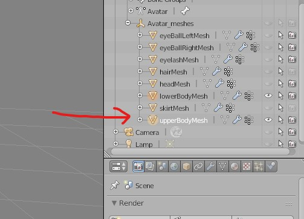
- Export the selection Only
- 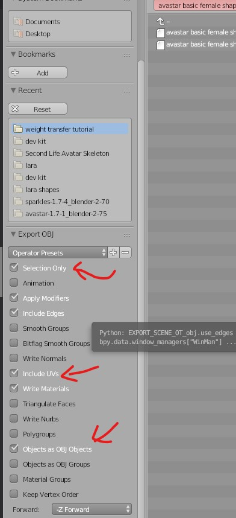
- Import the OBJ file
- 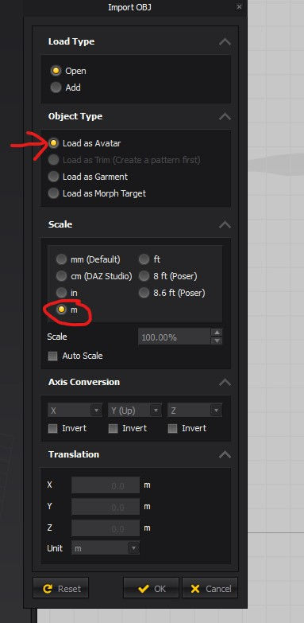

## Export from MD
- 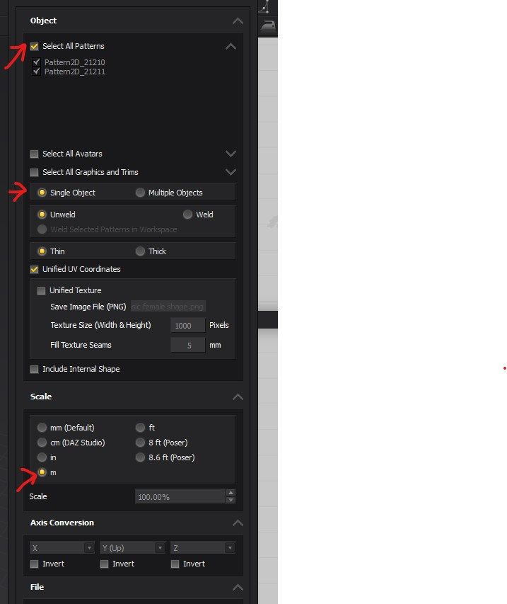

## Tools

### Select items created by the tool
- select the tool
- <kbd>CTRL</kbd> + <kbd>A</kbd>

### Common tools
#### Smooth Curve 
- for waist line

#### Pen tool (Same as photoshop)
- 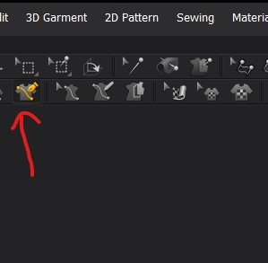
- Press <kbd>CTRL</kbd> and drag to have curves

##### Have symmetric lines on other side
- 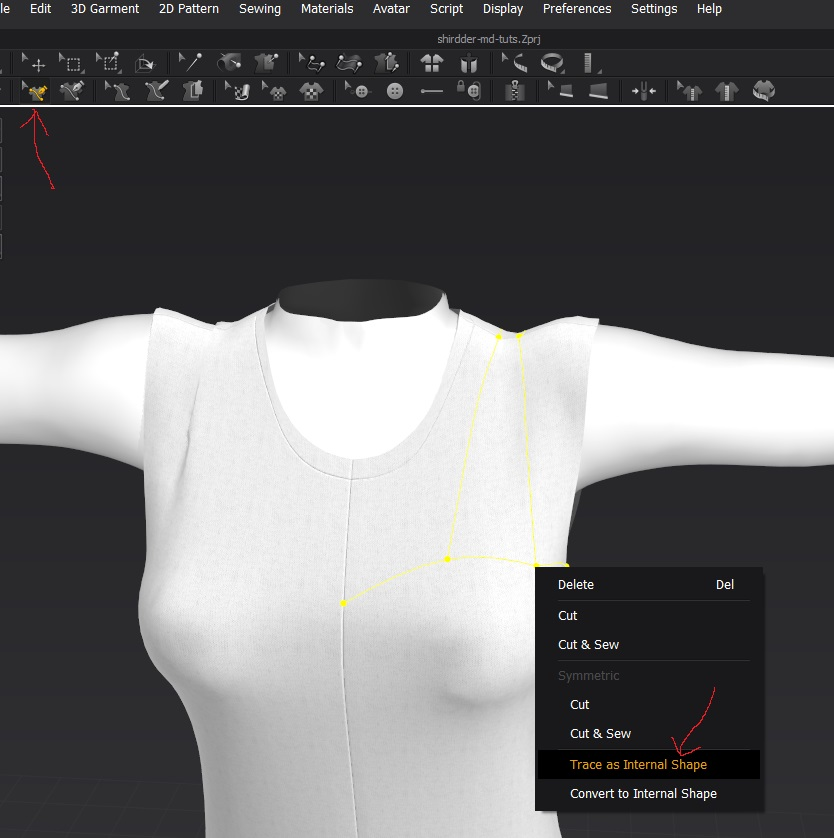
- then we can delete the drawn lines

## View

### X ray
- 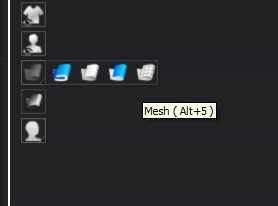

### Simulation property
- Select the garment in the `3D pattern window`
- 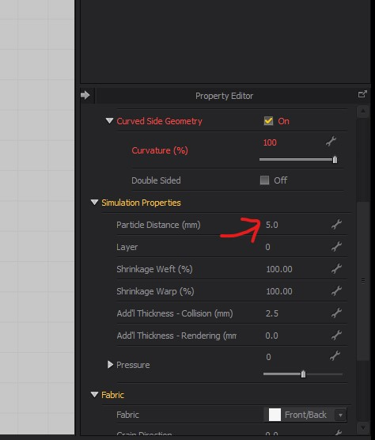
- Reduce the particle distance

## Pattern

### Add point proportionally
- hover over line
- <kbd>Right Click</kbd> and enter number in dialog

### add line to polygon
- Select the internal polygon tool
- 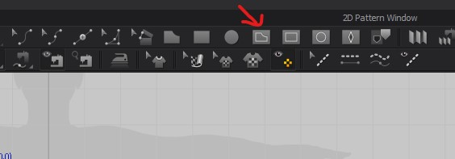
- to draw the line double <kbd>Left Click</kbd> on the final point

### Edit Pattern
- Select the edges
- Press <kbd>SHIFT</kbd> to only stretch the selected width of edges

## Sewing

### Smooth the stiches 
control whether the sewing should be inward or outward
- 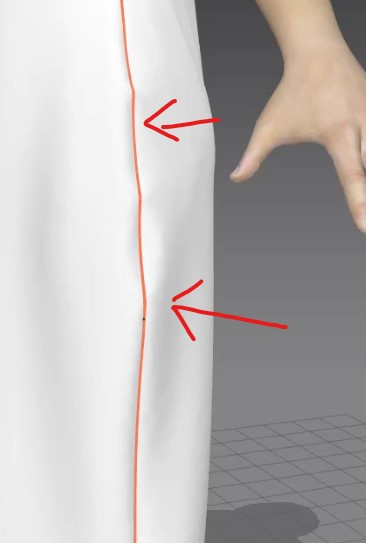
- 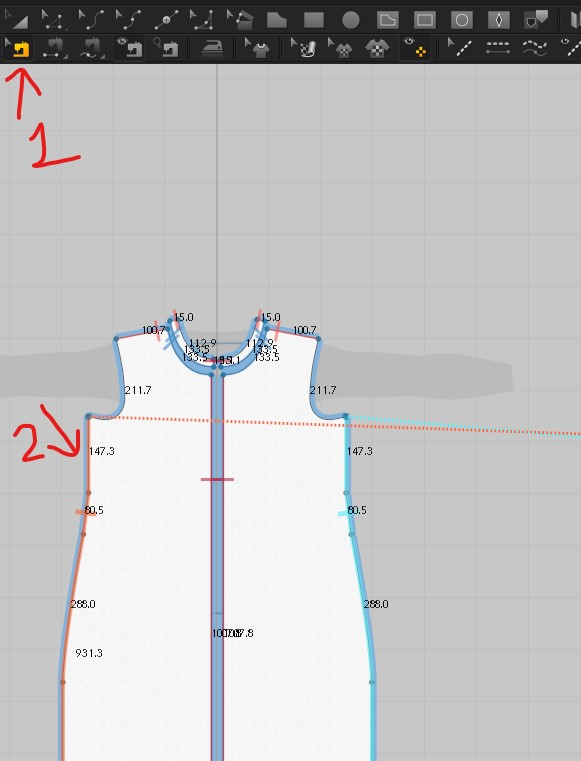
- 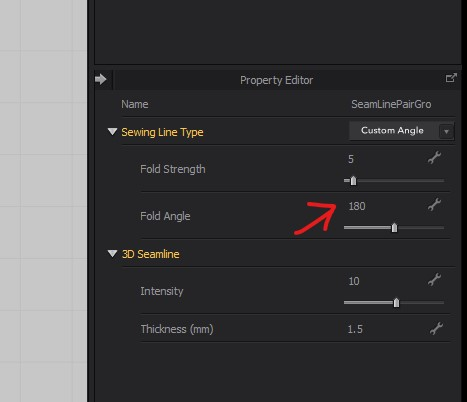

### Cut and sew
- selec the garment
- make marking on it with pen tool
- trace it [refer](#pen-tool-same-as-photoshop)
- select the markings and <kbd>Right Click</kbd> and select 
- 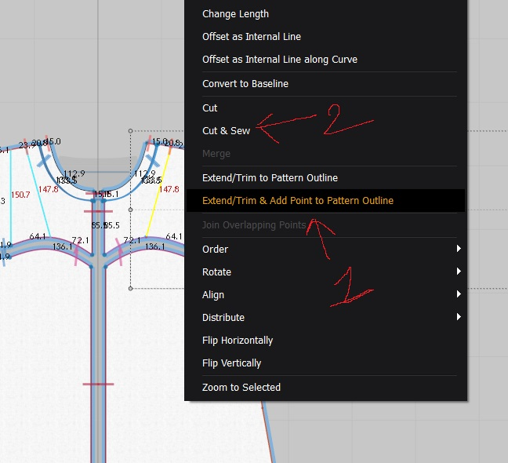

## Garment
### make the garment hang in the air
- 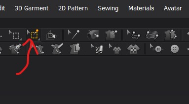
- click and drag the small point on the garment
- 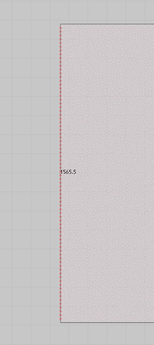
- Select the garment
- 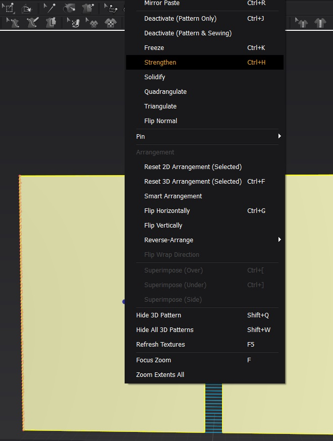

### Add fabric
- Select the cloth or part of cloth
- and press assign
- 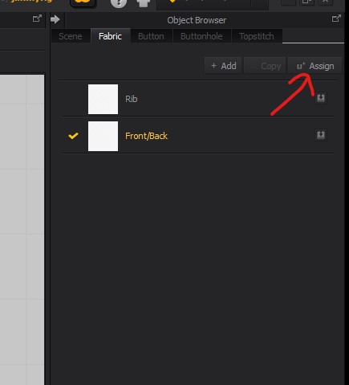
- set properties such as 
  - opacity - for translucence
  - type - velvet 
  - color

### Create shirring (elastic property)
- 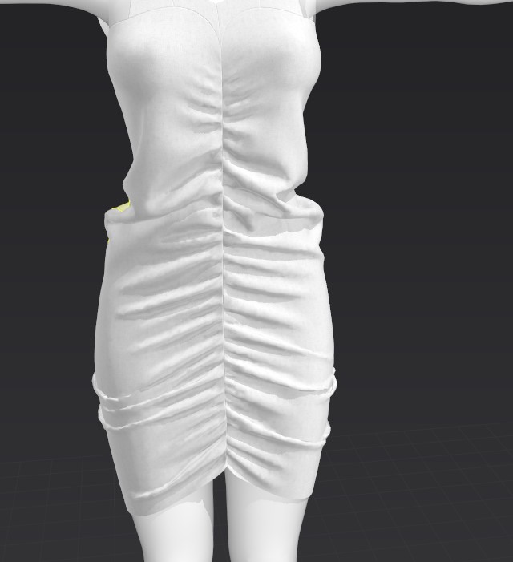
- 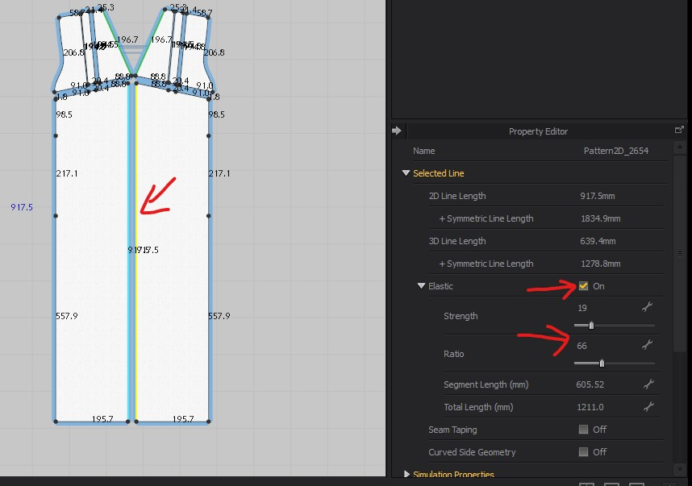