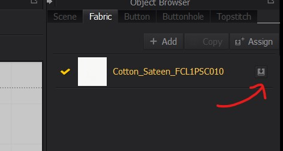

# Marvolous Designer

## import / export

### Import Mesh from Blender
- Select the Mesh
- 
- Export the selection Only
- 
- Import the OBJ file
- 

### Export from MD
- 

## in built
- 
- the module configurator is usually on the red line marked in the above image
- <kbd>Right Click</kbd> and select `Remove Modular relationship` to remove the grey overlay

## Tools

### Select items created by the tool
- select the tool
- <kbd>CTRL</kbd> + <kbd>A</kbd>

### Common tools
#### Smooth Curve 
- for waist line

#### Pen tool (Same as photoshop)
- 
- Press <kbd>CTRL</kbd> and drag to have curves

##### Have symmetric lines on other side
- 
- then we can delete the drawn lines

## View

### X ray
- 

### Simulation property

#### Particle
- Select the garment in the `3D pattern window`
- 
- Reduce the particle distance for higher quality

#### Layers
- if we want one object to be placed above other
- higher layer value the outermost element it will be

## Avatar

### move the pattern over `Arrangement points`
- 

## Pattern

### Add point proportionally
- hover over line
- <kbd>Right Click</kbd> and enter number in dialog

### add line to polygon
- Select the internal polygon tool
- 
- to draw the line double <kbd>Left Click</kbd> on the final point

<b>Note:</b> Pen tool can be also used to create internal pattern by <kbd>Right Click</kbd> and selecting internal shape
- 

### Edit Pattern
- Select the edges
- Press <kbd>SHIFT</kbd> to only stretch the selected width of edges

<b>Note: </b> clicking on the lines shows the length

### Symetric pattern
- select the shape with edit points tool
- <kbd>Right Click</kbd> and select `Symmetric Pattern`

### offset lines
- 
- select the line number 1 and <kbd>Right Click</kbd> and select `Offset as internal line`

### buttons
### add
- 
- item 1 is the add button in the pattern
- item 2 
  - select the placed button and copy it (<kbd>Right Click</kbd> for menu) and paste it
  - then right click where u want to paste select the number and distance
  - 

### button hole
- create symmetric pattern and add button to it
- with select/ move button tool and <kbd>Right Click</kbd> on the buttons
- 

#### panel
To modify button hole colors and other property
- 

### fasten button
- select the tool
- select the button and select the holes

## Sewing

### Smooth the stiches 
control whether the sewing should be inward or outward
- 
- 
- 

### Cut and sew
- selec the garment
- make marking on it with pen tool
- trace it [refer](#pen-tool-same-as-photoshop)
- select the markings and <kbd>Right Click</kbd> and select 
- 

## Garment
### make the garment hang in the air
- 
- click and drag the small point on the garment
- 
- Select the garment
- 

### copy fabric from library
- drag and drop the fabric from library to fabric panel
- assign to selected patterns
- 

### Add fabric
- Select the cloth or part of cloth
- and press assign
- 
- set properties such as 
  - opacity - for translucence
  - type - velvet 
  - color

<b>Note:</b> drag and drop the fabric over pattern

### Create shirring (elastic property)
- 
- 

### rotate internal divided lines
- 
- select the tool and then select the line

## Retopology
- 

### Edit topology
- 

#### multiselect
- <kbd>SHIFT</kbd> and select multiple

#### select and drag
- 

#### loop selection 
- double <kbd>Left click</kbd> on the vertices or edges

#### drag box
- press <kbd>CTRL</kbd> and drag the mouse to select vertices

#### delete
- <kbd>delete</kbd>

#### merge
- select multiple vertices
- <kbd>Right click</kbd> on vertex and select `Merge`

#### sub divide menu
- <kbd>Right click</kbd> and select the `Add division`
- 

#### sud divide keys
- select create topology
- hover over the topology pattern
- <kbd>SHIFT</kbd> + <kbd>CTRL</kbd>
- click to `confirm`

### Extrude
- enable edit topology
- <kbd>SHIFT</kbd> + <kbd>Left click</kbd> to select multiple edges
- <kbd>SHIFT</kbd> + <kbd>CTRL</kbd> and drag the mouse

### remesh
- to create a low poly mesh
- after the new `topology` pattern is drawn <kbd>Right click</kbd> and remesh all