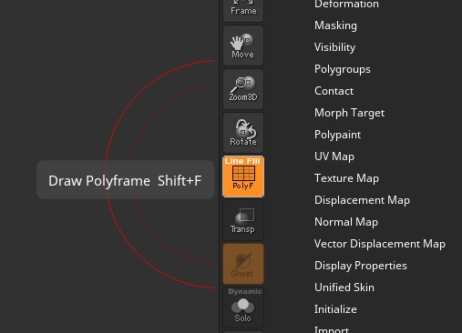
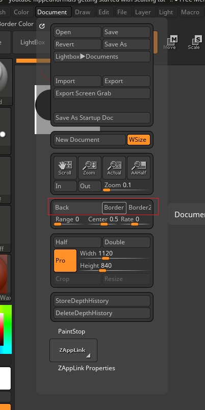
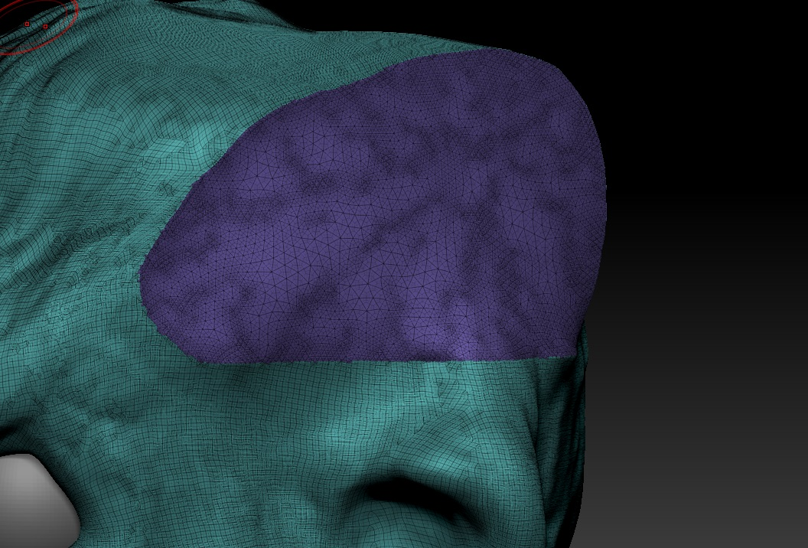
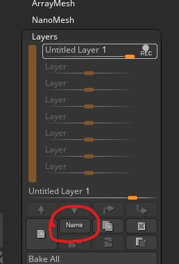

# ZBrush

## Start
- Select the Brush
- 

## Clear Canvas
<kbd>CTRL</kbd> + <kbd>N</kbd>

## Saving the document
- This will create another shape out of the existing one
- Its like saving the state

## View Wireframe
- <kbd>SHIFT</kbd> + <kbd>F</kbd>
- 

## Divide mesh into more polygons
- 
- or <kbd>SHIFT</kbd> + <kbd>D</kbd>
- and <kbd>D</kbd> for undo divide

### Dynamesh
- 
- click on DynaMesh and say `NO` in the pop up

## UI

### Quicksave
- 

### How to change the border color of canvas
- 
- Click on the border button
- Press and Hold and Drag the mouse anywhere on the UI

### Change brush props
- 

### show the floor of the model
- 

### scroll-tools
- 

## Edit/ Transform mode

### Moving the Mesh
- <kbd>Right Click</kbd> and move the mouse to `Rotate`
- <kbd>ALT</kbd> + <kbd>Right Click</kbd> and move the mouse to `Pan`
- <kbd>CTRL</kbd> + <kbd>Right Click</kbd> and move the mouse to `Zoom`

### Straigthen the mesh
- press and hold <kbd>Right Click</kbd> 
- press <kbd>SHIFT</kbd>
- release the <kbd>Right Click</kbd>

### Brush options
- 
- Or use the `Zsub` button
- after the shape is drawn
- 
- click on edit (Next to draw)
- 
- click on Make PloyMesh3d
- <kbd>left click</kbd> on shape for sculpting out
- <kbd>ALT</kbd> + <kbd>Left Click</kbd> for sculpting in

## Common Brushes
- <kbd>SHIFT</kbd> for smooth brush
- Standard
- Clay
- ClayBuildup
- DamStandard 
  - draws lines
- TrimDynamic
- Move

## Trim 
- <kbd>CTRL</kbd> + <kbd>SHIFT</kbd> 
- Drag the mouse
- release

### Mirror Trim
- First trim one side
- Go to Geometry Tools
- 
- select `Mirror`
- 

#### If mirror trim doesnt work
- Go to Deformation
- 

## Change Brush Texture
- 

## Activate Symmetry
- 
- or <kbd>SHIFT</kbd> + <kbd>X</kbd>

### Radial Symmetry
- 

## Select only what is required
- 
- <kbd>CTRL</kbd> + <kbd>SHIFT</kbd> + <kbd>Left Click</kbd> and drag the mouse over the mesh
- or <kbd>ALT</kbd> + <kbd>CTRL</kbd> + <kbd>SHIFT</kbd> + <kbd>Left Click</kbd> to select the inverse of selection

### From the Menu
- 

### Unselect
- <kbd>CTRL</kbd> + <kbd>SHIFT</kbd> + <kbd>Left Click</kbd>

### Select trimed section
- 
- <kbd>CTRL</kbd> + <kbd>SHIFT</kbd> + <kbd>Left Click</kbd> on the different color

### Group Selection
- <kbd>CTRL</kbd> + <kbd>W</kbd>

## Add DynaMesh to specific region
- Go near the region
- <kbd>CTRL</kbd> + <kbd>Left Click</kbd>
- drag the mouse near the region but not touching the region
- release

## Add subtool (More Mesh objects on main mesh)
- 
- Click on `Append`
- 

### select one subtool at a time

### Divide the selection into Sub Tool
- [Select only what is required](#Select-only-what-is-required)
- [Group Selection](#Group-Selection)
- Go to `subtools` -> `split`
- 

## Masking (From any brush)
- <kbd>CTRL</kbd> + <kbd>Left Click</kbd> and draw

### Select the Inverse
- <kbd>CTRL</kbd> + <kbd>Left Click</kbd> outside the model
### Unselect Mask
- <kbd>CTRL</kbd> + <kbd>Left Click</kbd> drag a selection outside the model

### Soften the Mask
- [First draw the Mask](#masking-from-any-brush)
- 

### Group the drawn Mask
- <kbd>CTRL</kbd> + <kbd>W</kbd>
- <kbd>CTRL</kbd> + <kbd>W</kbd> again to ungroup and group all model

## Layers
Record and undo
- 
- Draw something
- 
- Stop the recording
- 
- Go back and forth with the drawn part
- 
- Rename the layer

## ZSphere
- 
- Click on the surface
- 
- Move it
- 
- click on any ring to move it
- <kbd>ALT</kbd> + <kbd>Left Click</kbd> to delete (While the `draw` mode is on)

### Free moving parts
- Reduce the Draw Size to `1` - to have parts which doesnt make the other parts to move
- 

### Convert to Polymesh
- 
- Click on preview
- 
- Click on make Polymesh 3d