# UI

## Viewport
- select viewport button (info is the default)
- 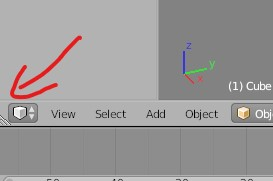
- new view port button
- 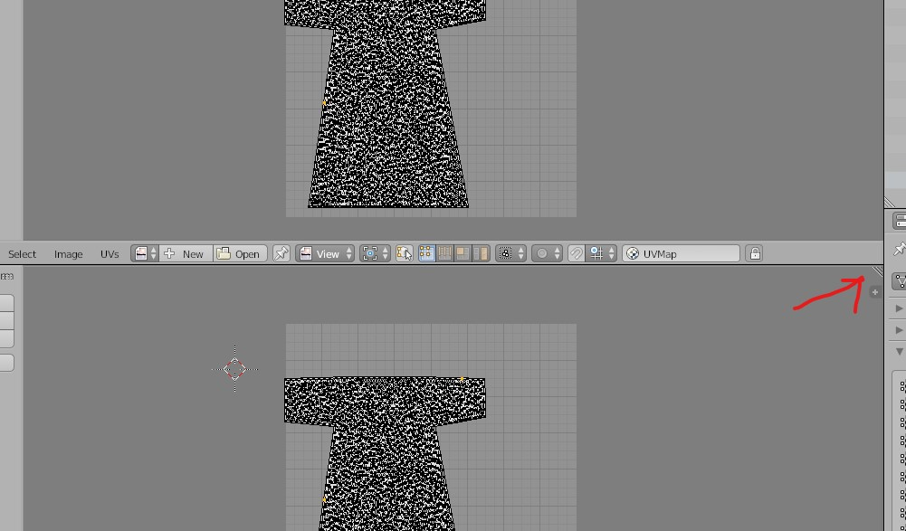
- <kbd>Left Click</kbd> on the three diagonal lines and drag the mouse into the other window
- or drag the three diagonal line at the bottom to split screen

# Weight paint and weight transfer
- Select the imported cloth
- Select the clothing layer (<kbd>shift</kbd> + <kbd>right click</kbd>)
- Change the object mode to weight paint mode
  - 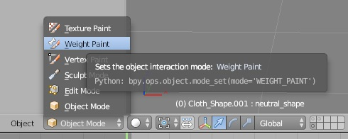
- Go to tools 
  - 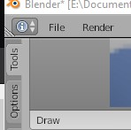
- Select trasnfer weight
  - 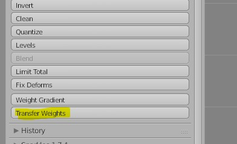

## If the weight paint is not getting applied
- 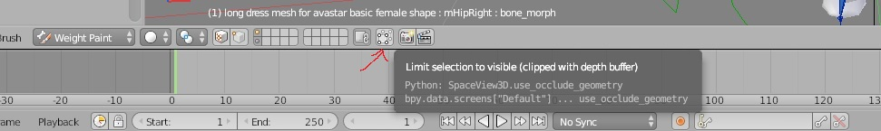

## Transfer the weight between mesh
- place the mesh over the target mesh
- 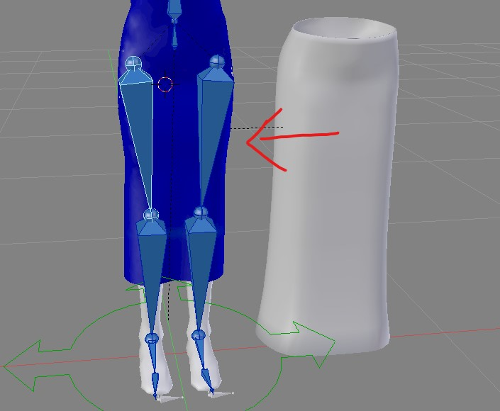
- select both the mesh
- 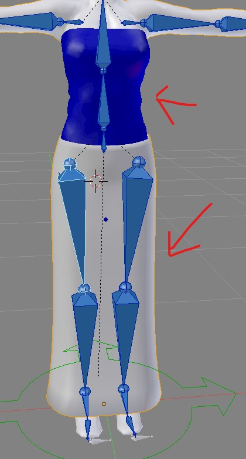
- Also select group as active
- 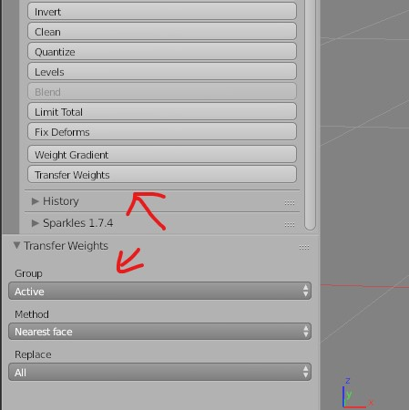
<b>Note: </b> if this setting is not available just select any mesh and click on `transfer weight`
- go to tools -> weight tools -> transfer weight
- 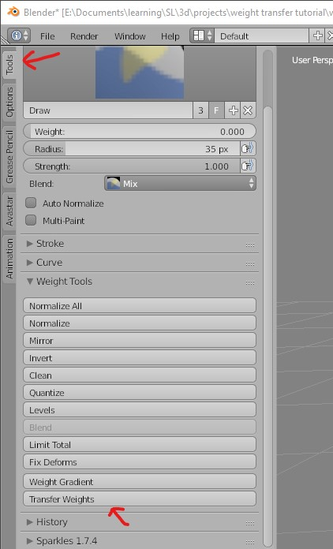

## To remove the sticky sides
- Select te cloth
  - 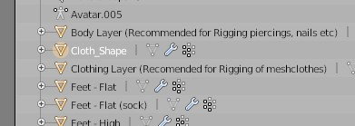
- select the heat signature places (Bones or the diamonds)
  - 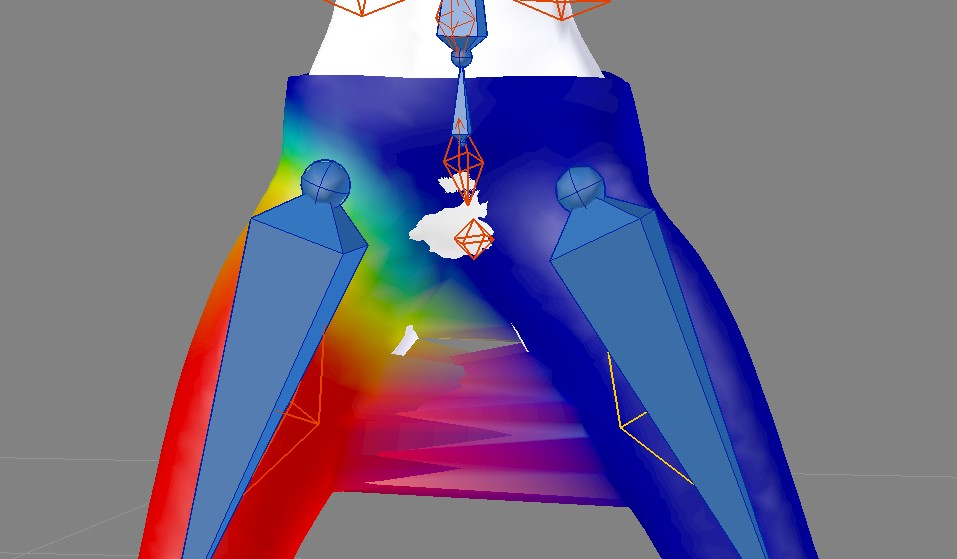
- Select the face selection masking tool
  - 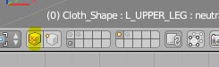
- when to cool it down
  - 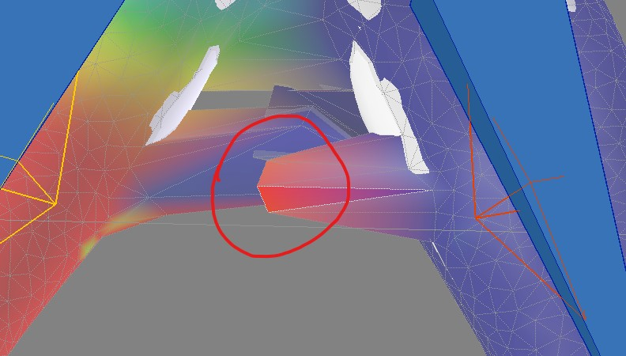
- when to heat it up
  - 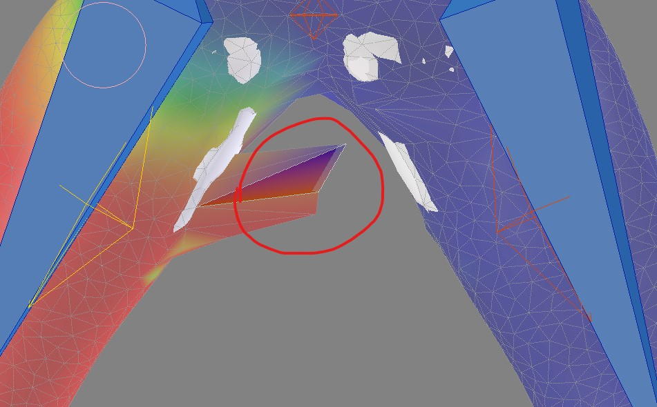

# Seperate the imported cloth
- Select the cloth (Right click)
- Change the object interaction mode to edit mode
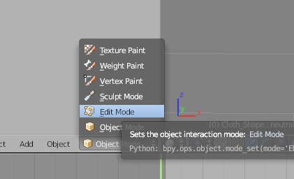
- Press <kbd>a</kbd> to select all or unselect all
- Hover over the imported cloth
  - Press <kbd>l</kbd> to select its inner layer
  - Press <kbd>p</kbd> 
  - 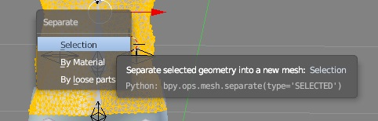
  - Select `Selection`

# change the Bone Display Style
- Go to Avastar tab
  - 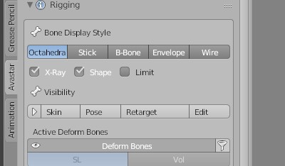
- Select the style