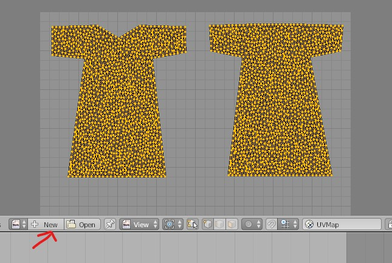
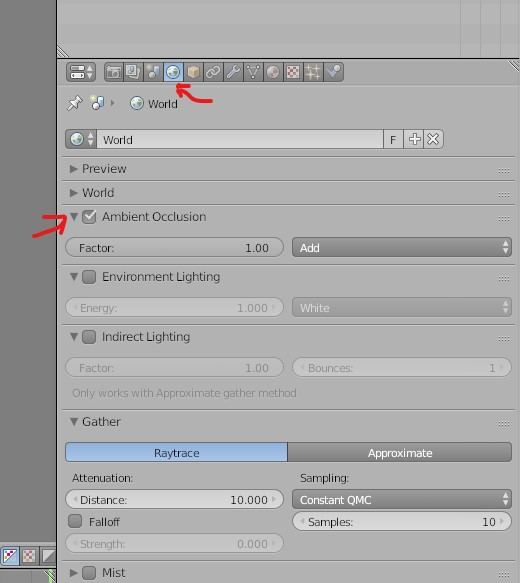
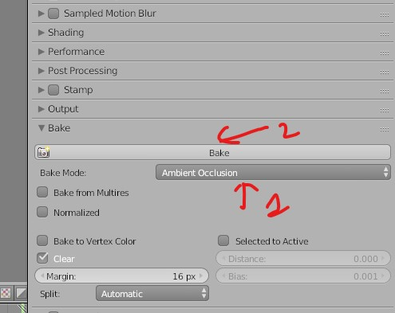
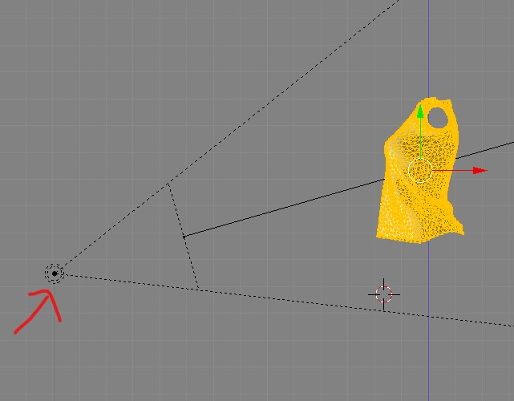
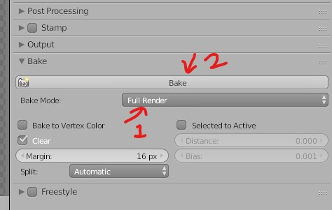
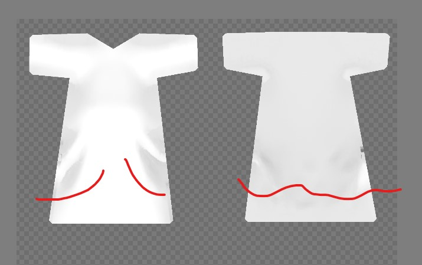
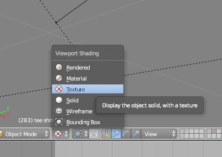
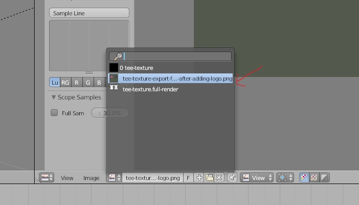

# Blender 2.7

## Viewport

### Split screen and join screen
- Select viewport button (info is the default)
- 
- New view port button
- 
- <kbd>Left Click</kbd> on the three diagonal lines and drag the mouse into the other window
- or drag the three diagonal line at the bottom to split screen

### Undo history menu
<kbd>CTRL</kbd> + <kbd>ALT</kbd> + <kbd>Z</kbd>

### Divide the Mesh into selection parts
- Select the cloth (<kbd>Right click</kbd>)
- Change the object interaction mode to edit mode
- 
- Press <kbd>a</kbd> to select all or unselect all
- Hover over the imported cloth
  - Press <kbd>L</kbd> to select its inner layer
  - Press <kbd>P</kbd> 
  - 
  - Select `Selection`

## Weight paint
### and weight transfer
- Select the clothing layer (<kbd>SHIFT</kbd> + <kbd>right click</kbd>)
- Select the imported cloth
- Change the object mode to weight paint mode
  - 
- Go to tools 
  - 
- Select trasnfer weight
  - 

### If the weight paint is not getting applied
- 

### Transfer the weight between mesh
- place the mesh over the target mesh
- 
- select both the mesh
- 
- Also select group as active
- 
<b>Note: </b> if this setting is not available just select any mesh and click on `transfer weight`
- go to tools -> weight tools -> transfer weight
- 

### To remove the sticky sides
- Select the cloth
  - 
- select the heat signature places (Bones or the diamonds)
  - 
- Select the face selection masking tool
  - 
- when to cool it down
  - 
- when to heat it up
  - 

## Texturing

### Create
- Select the mesh
- click on New and add the name
- 

### Baking (Generating the texture Maps)

#### AO (Ambient Occulusion)
- select the mesh and go into `edit mode`
- Make sure the ambient texture is on under tools world -> Ambient Occulusion
- 
- Go to camera tool
- Under Bake and select Ambient Occulusion
- 

#### Full Bake
- select the mesh and go into `edit mode`
- Make sure AO is unchecked in the world
- 
- adjust the lighting on the mesh
- 
- Click on bake
- 
- after bake will get this

#### Importing the texture
- 
- make sure the texture mode is on
- 
- Go to edit mode and select the texture
- 