# Blender 2.7

## Viewport

### Render Engine
- for viewing the `Material` view
- 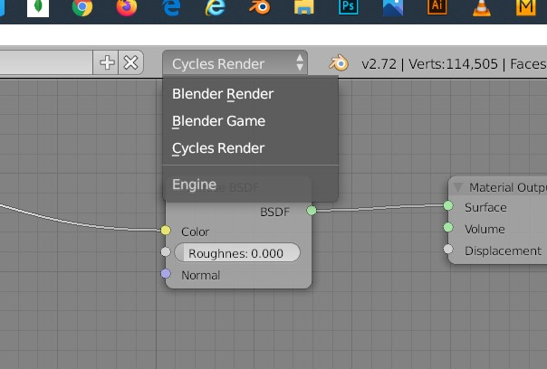

### Toggle rendered and solid mode
- <kbd>SHIFT</kbd> + <kbd>Z</kbd>

### Split screen and join screen
- Select viewport button (info is the default)
- 
- New view port button
- 
- <kbd>Left Click</kbd> on the three diagonal lines and drag the mouse into the other window
- or drag the three diagonal line at the bottom to split screen

### Undo history menu
<kbd>CTRL</kbd> + <kbd>ALT</kbd> + <kbd>Z</kbd>

### Divide the Mesh into selection parts
- Select the cloth (<kbd>Right click</kbd>)
- Change the object interaction mode to edit mode
- 
- Press <kbd>a</kbd> to select all or unselect all
- Hover over the imported cloth
  - Press <kbd>L</kbd> to select its inner layer
  - Press <kbd>P</kbd> 
  - 
  - Select `Selection`

### Camera
- lock the camera to pan/ move/ rotate it
- press <kbd>Num 0</kbd>
- 

#### Rotate around the object
<kbd>Middle mouse</kbd> 

## Object (Mesh)

### Movement
#### snap to center
- move the cursor to center
- in the object mode
- 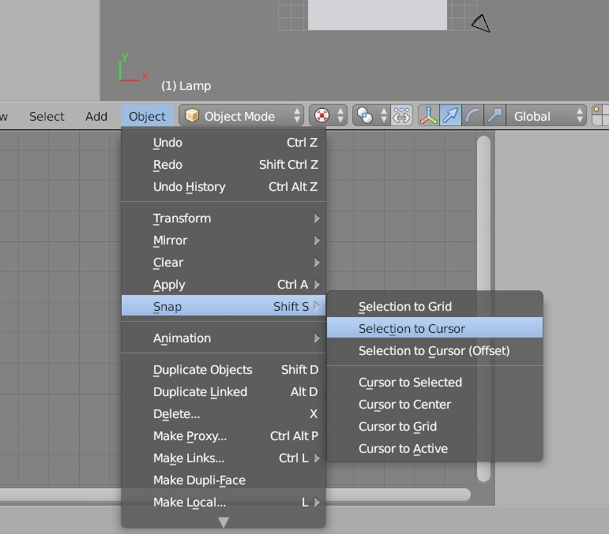

### Duplicate
- select the mesh
- <kbd>SHIFT</kbd> + <kbd>D</kbd>

## Armature

### lock the location of the bones
- 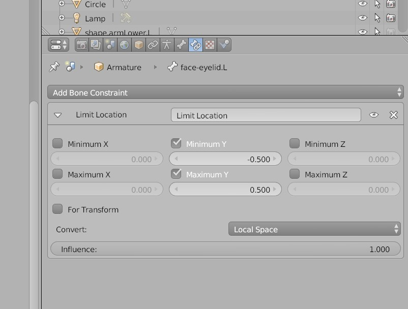

### lock the axis
- 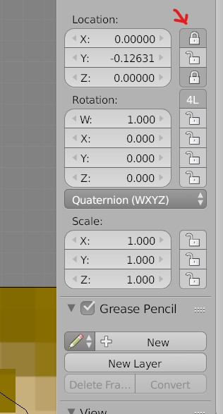

## Render view

### Show / hide mesh
- 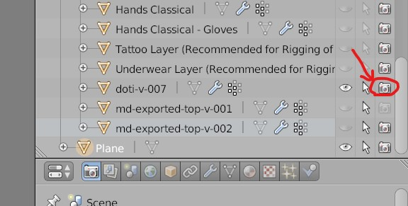

## Edit Mode

### Tools
- 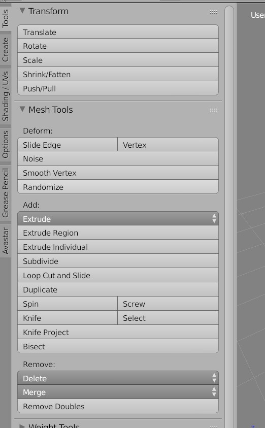

### Select along the vertex, face, edge
- 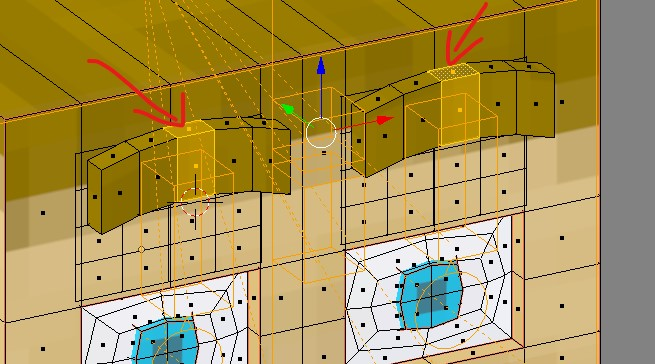
- <kbd>ALT</kbd> + <kbd>Right Click</kbd>

### Edit mode the drag is lagging
- make sure the shape keys value is zero
- and the `Apply Shape keys in edit mode` is off
- 

## Modifiers

### subdivide for sculpting 
- 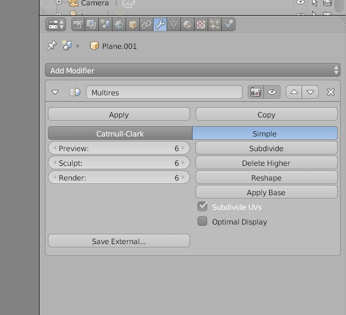

## Shape keys

### Add new
- the default key is basis - i.e. its like nothing is edited in the mesh
- add another key (and then rename it)
  - make sure the value is 0
- go to edit mode 
  - edit the vertices, edges or faces
- go to object mode
- change the value of the shape key from 0 to 1

### adding another on top of added ones
- reset the previous ones to value 0

## Drivers
Animate the shape keys on bone movement

### Add
- 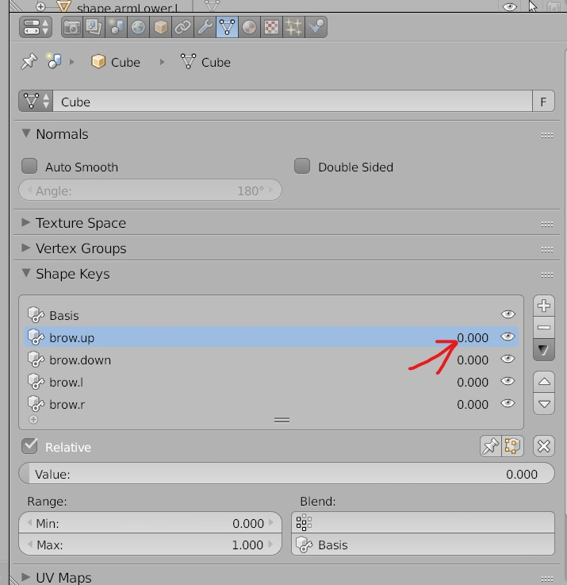
- <kbd>Right Click</kbd> on the value numbers and select add drivers

### Graph editor
- 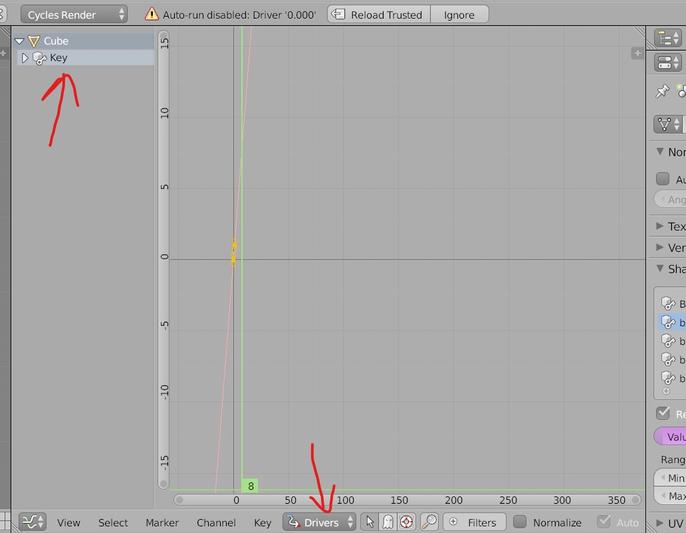
- once the key is added it will appear in the left panel
- select the drivers view

### Add animation
- 
- select the new key
- select type
- select Obj/Bone
  - select the sub bone (face-brows) of the armature
- select direction (Y location) and `local space` in which the animation to be made
- add modifier and select the direction value
  - this value decides the speed at which the shape key value change with the bone movement

### Proportional editing
- the parts of the mesh which gets selected by pressing <kbd>L</kbd> are called `Connected`
- 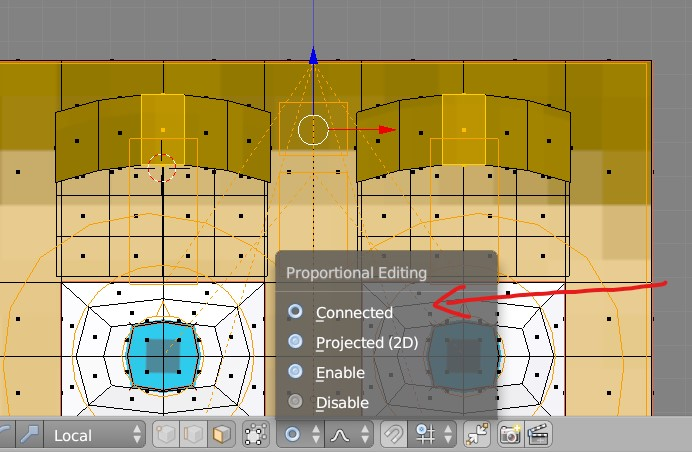

## Weight paint
### and weight transfer
- Select the clothing layer (<kbd>SHIFT</kbd> + <kbd>right click</kbd>)
- Select the imported cloth
- Change the object mode to weight paint mode
  - 
- Go to tools 
  - 
- Select trasnfer weight
  - 

### If the weight paint is not getting applied
- 

### Transfer the weight between mesh
- place the mesh over the target mesh
- 
- select both the mesh
- 
- Also select group as active
- 
<b>Note: </b> if this setting is not available just select any mesh and click on `transfer weight`
- go to tools -> weight tools -> transfer weight
- 

### To remove the sticky sides
- Select the cloth
  - 
- select the heat signature places (Bones or the diamonds)
  - 
- Select the face selection masking tool
  - 
- when to cool it down
  - 
- when to heat it up
  - 

## Texturing
<b>Note: </b> look for tiled image for texturing

### Create
- Select the mesh
- click on New and add the name
- 

### Baking (Generating the texture Maps)
<b>Note: </b> if the exported obj doesnt have the uv layer with texture, then select the render engine - blender render

### Bake Node
- select the node where the blender should save the bake to
- do not join the node to diffuse BSDF or the output node
- 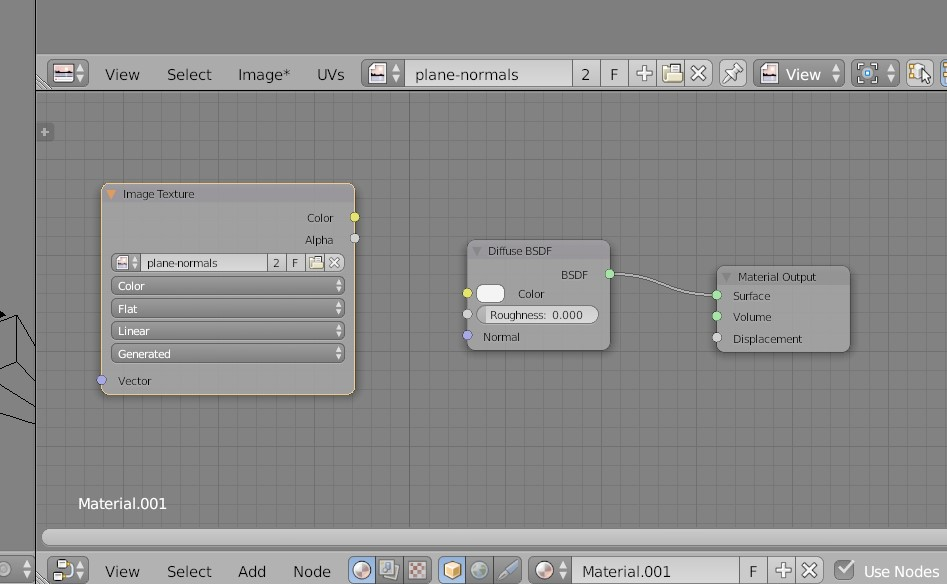

### baking the normals
- select the mesh u want to have as normal (source mesh)
- select the destination mesh
- 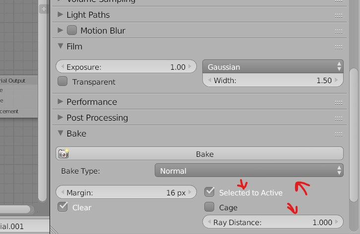

#### AO (Ambient Occulusion)
- select the mesh and go into `edit mode`
- Make sure the ambient texture is on under tools world -> Ambient Occulusion
- 
- Go to camera tool
- Under Bake and select Ambient Occulusion
- 

#### Full Bake
- select the mesh and go into `edit mode`
- Make sure AO is unchecked in the world
- 
- adjust the lighting on the mesh
- 
- Click on bake
- 
- after bake will get this

#### Importing the texture
- 
- make sure the texture mode is on
- 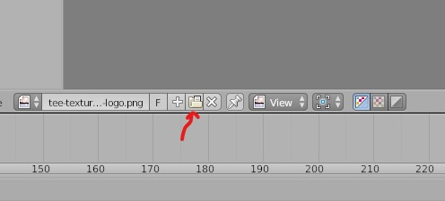
- Go to edit mode and select the texture
- 

### Rendering
- sampling
- 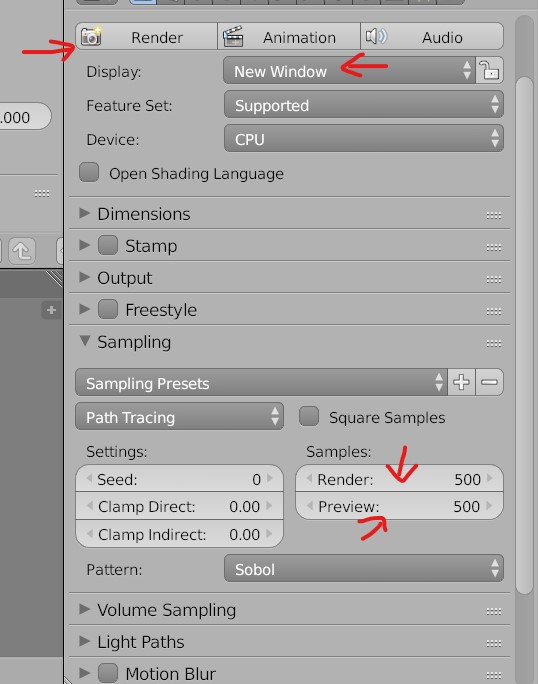
- select new window to render in new `blender window`
- higher Render and Preview - high quality and higher computer resources will be used

## UV Editor
- select the editor type as `UV Editor`
- select the mesh
- go to edit mode
- select the mesh parts
  - now you will get the UV maps
- 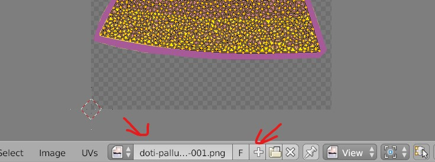

## Node Editor
<b>Note: </b> change the method to display view from rendered to solid in order to reflect the chnages of nodes
- 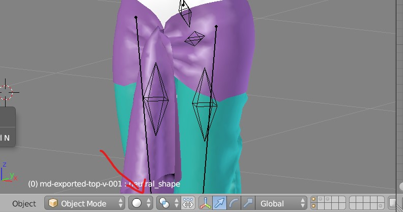

### types of node
#### for Image texturing
- 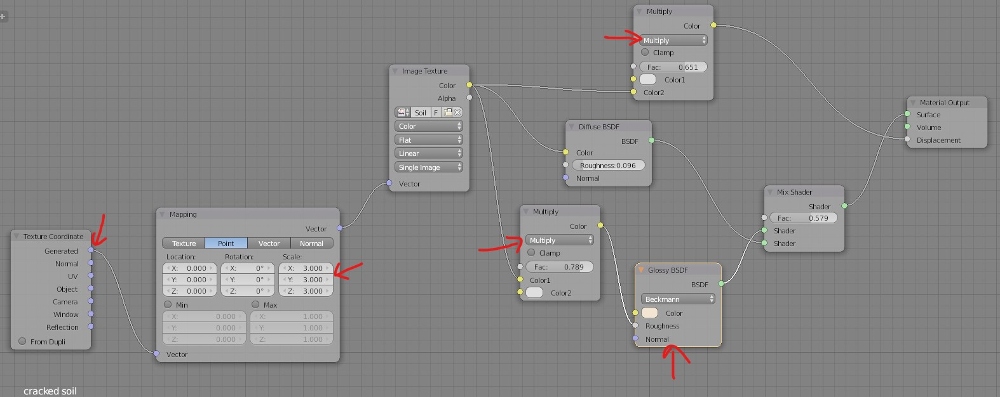
- nodes
  - shader 
    - glossy BSDF - for shinnyness
    - mix shader
  - color 
    - mix RGB - for creating `Multiply` effect
  - input 
    - texture coordinate 
      - to select the image maps (UV, normals)
      - VERY IMPORTANT in case the UV are missing in the normal map
  - vector 
    - mapping to arrange the texture image on the mesh
    - bump - to give height to particles on the surface
      - for bump maps

#### bump and specular maps
- 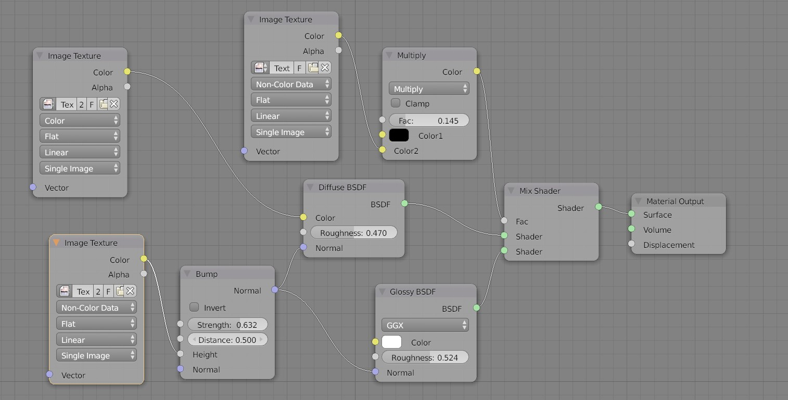

## Add normal map
- add material and then select `image texture` 
- 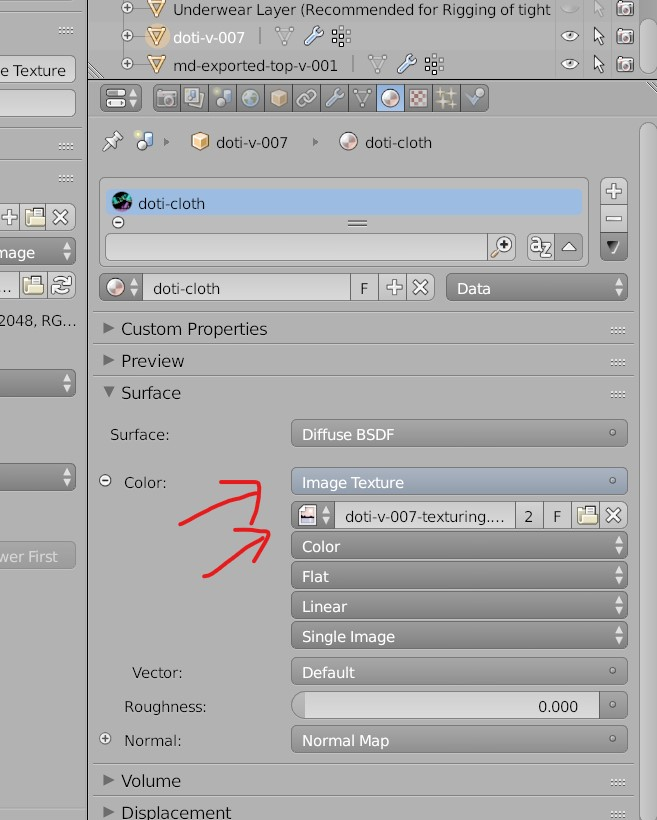
- 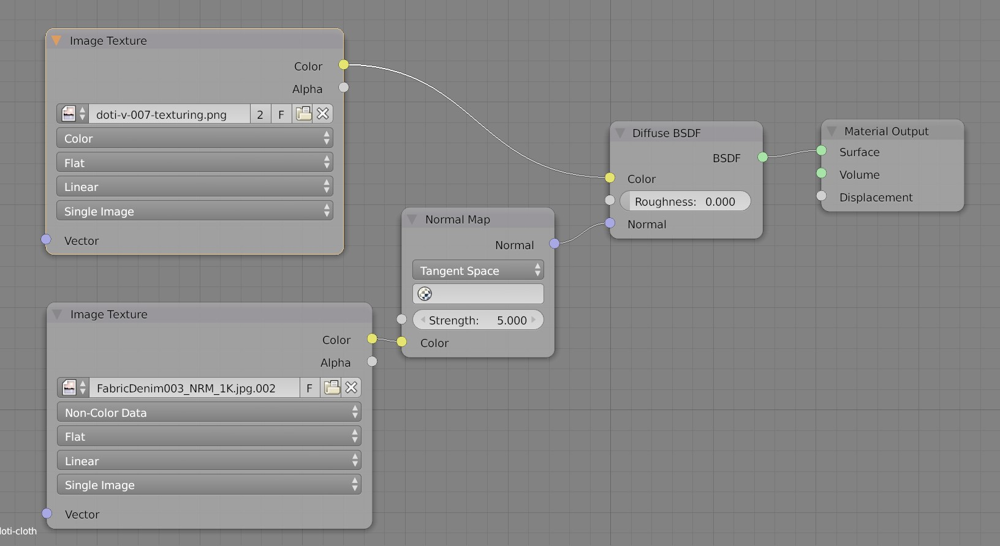

## Lighting
### defualt world light
we get this when no light source are added
- 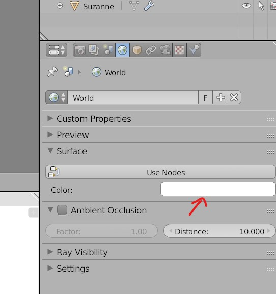
- change color
- 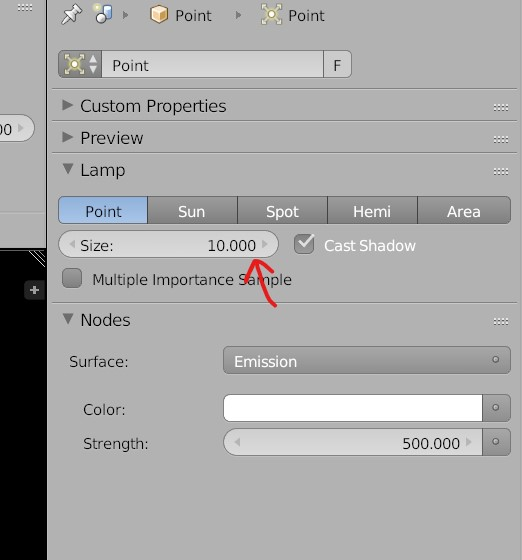
- light spread

### types of light
- Sun
  - only can be rotated
  - location wont change the shadow
- point 
  - projects light on object in a direction
- area light
  - can be made rectangular
  - 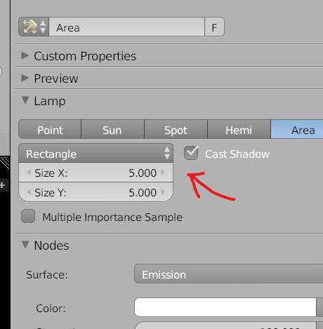 

### falloff
- switch to `node editor`
- 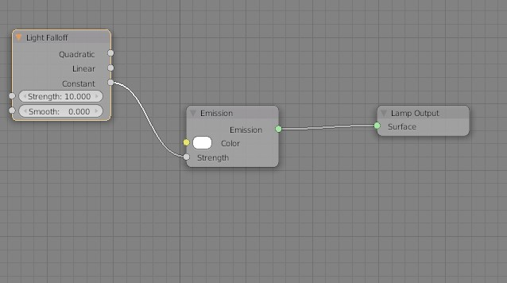 

#### constant
the light spread will be low or high
- 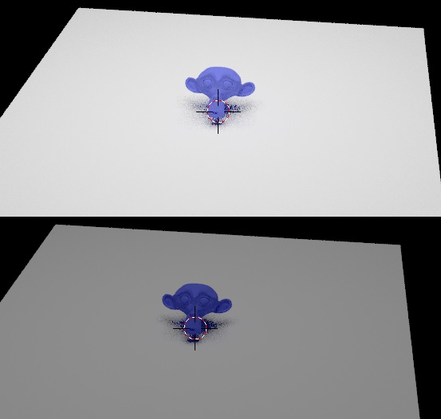 
- high(top) vs low (bottom)