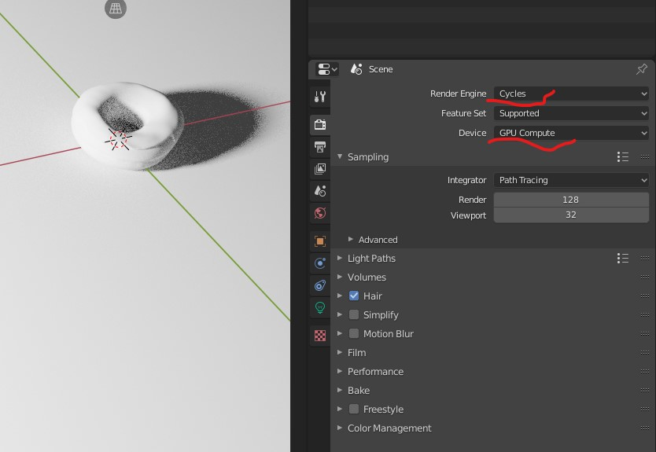
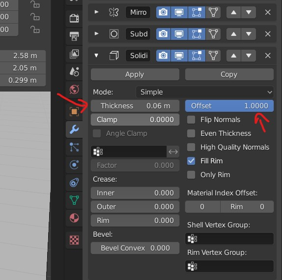
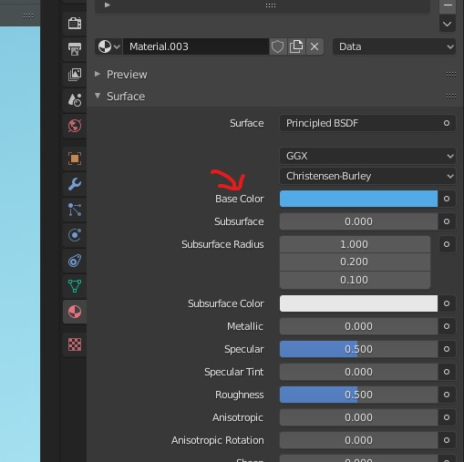
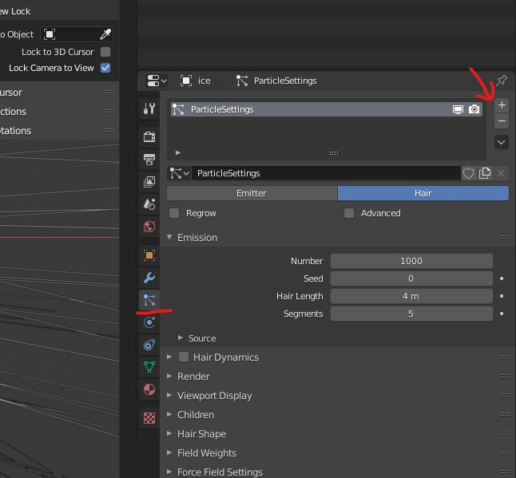
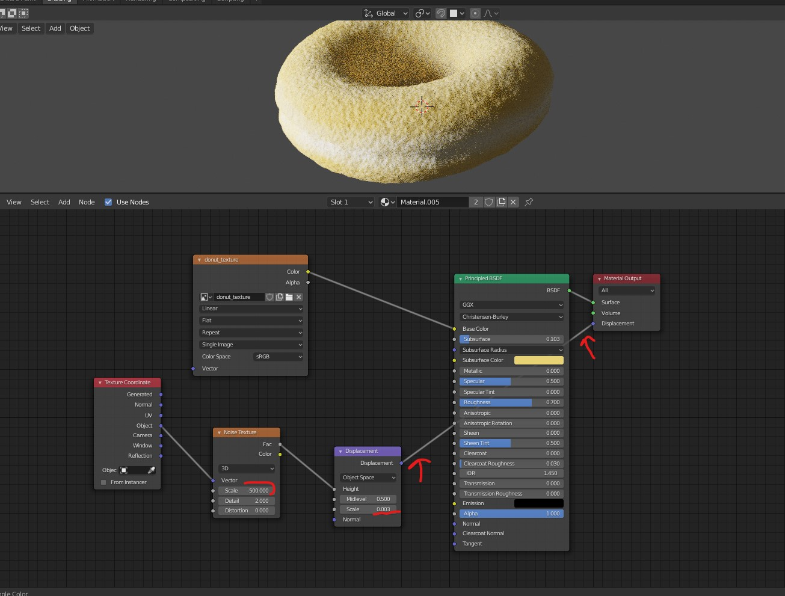

# Blender 2.82a
# Level 1

## Tranformation
- 
- <kbd>Left Click</kbd> on the object and tranform it
- <kbd>Right Click</kbd> to reset the tranform

## viewport
### Change the  axis
- <kbd>`</kbd> to open the menu
- Numpad keys
- <kbd>ALT</kbd> + <kbd>Middle Mouse</kbd> + move mouse

### Split the viewport
- <kbd>Right Click</kbd> on the red marking
- 

### Rendered 
To see the light on the object
- 
- or Press <kbd>Z</kbd>

### Light
- 

### Light settings
- 

### 3D cursor
Drops the new objects over the 3d cursor when they are added in the viewport
- 
- <kbd>SHIFT</kbd> + <kbd>Right Click</kbd> - to move it
- <kbd>SHIFT</kbd> + <kbd>C</kbd> - to centre the cursor

### Change View for the mode (Layout, sculpting, etc)
- Press <kbd>N</kbd>
- 

### Render Engine
- 
- can change the render engine to Eveee (For Low graphics ex. games)
- can change the render engine to Cycles (For High graphics)

### Create a image
- Render -> Render Image
- Or Press <kbd>F12</kbd>

### View through the camera
- 

## Add
- <kbd>SHIFT</kbd> + <kbd>A</kbd> to add mesh

## Start Search
- <kbd>F3</kbd>

## Set Monkey head on Fire
- Add monkey
- select monkey in object mode
- F3 -> add Quick Smoke
- (different from the video) select monkey
- choose Physics->Setting->Flow Type : "FIre + Smoke"
- (different from the video) select "Smoke Domain" object (the box around the monkey)
- In physics panel click "Bake Data" and wait... (progress in status bar on the bottom)
- After it 's finished play the animation.

## Toggle X Ray
- 

## Proportional editing
For editing the vertices near by
- 
- Enable it
- select any vertice or vertices
- Press <kbd>G</kbd> and move the object
- 
- Scroll mouse up or down to get the lumpiness

### Moving the vertices
To stick the dragging object on the surface, instead of going inside the surface of other selections
- 

## Smooth the object
- select the object by clicking on the object
- 

## Add Modifiers
- 
- 

<b>Note:</b> The order of modifiers is important

### Subdivision
We can smooth the surfaces with these
- 

### Solidyfy
- 

## Selection
<b>Note:</b> Edit mode should be on

### Select the duplicates on the object 
- <kbd>SHIFT</kbd> + <kbd>D</kbd> to duplicate the selection
- Select any vertice of the duplicate
- <kbd>CTRL</kbd> + <kbd>L</kbd>

### Seperate the selection
- <kbd>SHIFT</kbd> + <kbd>D</kbd> to duplicate the selection
- Press <kbd>P</kbd> and select the `Selection` option

### All
- <kbd>Left Click</kbd> on the object
- Press <kbd>A</kbd>

### loops
- <kbd>ALT</kbd> + <kbd>Left Click</kbd> the vertex for vertical or horizontal selection of the lines running through the vertex
- 
- <kbd>CTRL</kbd> + <kbd>I</kbd> to invert the selection

### Hide the selection
- Press <kbd>H</kbd>
- To unhide <kbd>ALT</kbd> + <kbd>H</kbd>

### Extrude the selection
- Select the vertices
- Press <kbd>E</kbd>

### Create a loop on the mesh
- 
- Select the model
- <kbd>CTRL</kbd> + <kbd>R</kbd>
- scroll up and down to add more loops or reduce

## Subdivide
<b>Note:</b> Edit mode should be on
- <kbd>Right Click</kbd> on the object
- Select `Subdivide`

### Increase the smoothness
- 

## Join object
- Aefore joining
- 
- Select the parent object
- Then select the child object
- <kbd>CTRL</kbd> + <kbd>P</kbd> and select the `Object (Keep Transform)`
- After Joining
- 

## Adding Material
- 
- 

### Material Properties
- Color
- Roughness (glossy to rough)
- Subsurface
  - Radius - R, G, B
  - Color 
    - give similar to object color
    - this is when the light goes into the object
    - like the thin layer of skin becomes red as we see it on the bright light

## Weight Paint
- 
- reduce weight to have blue
- more weight gives red

### More weight paint layers on object
- 

## Adding Particles 
- Select the object on which you want to add particles
- 
- Option Emmission -> seed - emits a different pattern in the way partcles are added

### Select the object to duplicate on top of previously selected object
- 
- Select the object

### Rotating
- 

### selecting the vertex group (weight painter group)
- Particle property -> Vertex Group
- 

### set origin
The origin is the point which will be attached to the surface of the object on which the particles are added
- Select the objects
- <kbd>Right Click</kbd> 
- set origin -> origin to geometry

### set priority
- 

# Sculpting

## Brush
- To adjust the brush press <kbd>F</kbd>
- To adjust the brush strenth press <kbd>F</kbd> + <kbd>F</kbd>

# Shading
- Select new object
- Add material
- 

## Add new node
- <kbd>SHIFT</kbd> + <kbd>A</kbd>

## Common nodes
- input -> object info
- converter -> color ramp
- texture -> image texture

## Procedural Texturing
- Texture -> Noise texture
- <kbd>CTRL</kbd> + <kbd>SHIFT</kbd> + <kbd>Left Click</kbd> on the noise menu panel

<b>Note:</b> Also in the preferences enable add on - noise wrangler

- add vecter -> displacement
- 
- <kbd>CTRL</kbd> + <kbd>SHIFT</kbd> + <kbd>Left Click</kbd> on the panel `principled BSDF` (main layer)
- View in the render mode

### 2 layers of Procedural Texturing
- add 2 noise texture
- pass one through colorRamp - to darken the 2nd noise
- Add them
- Overlay the texture with noise and set the displacement scale very low
- 

# Texture Paint
- Add new texture
- save the new texture on the hard drive or <kbd>ALT</kbd> + <kbd>S</kbd> for quick save
- Go to shading and add `texture -> image texture`
- select the neew texture in the node

## Choose Color
- Press <kbd>N</kbd>
- pick the new color
- Press <kbd>X</kbd> to select

## Texture Mask
- Go to texture mask
- New
- 

### Brush Overlay (darken with same color)
- 