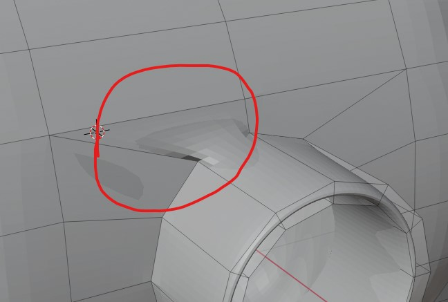
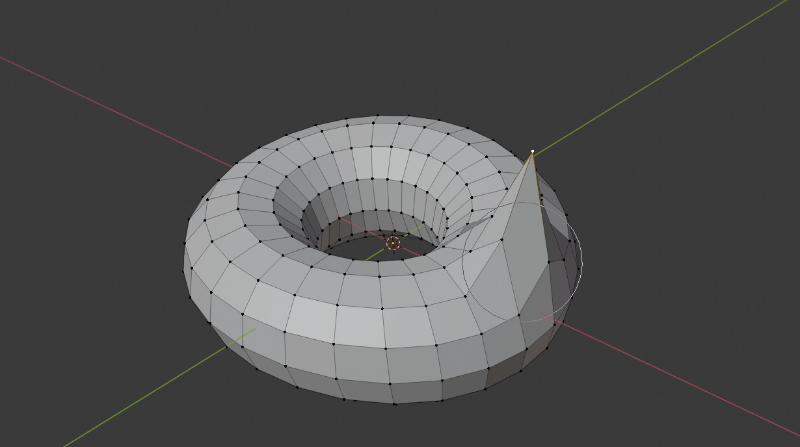
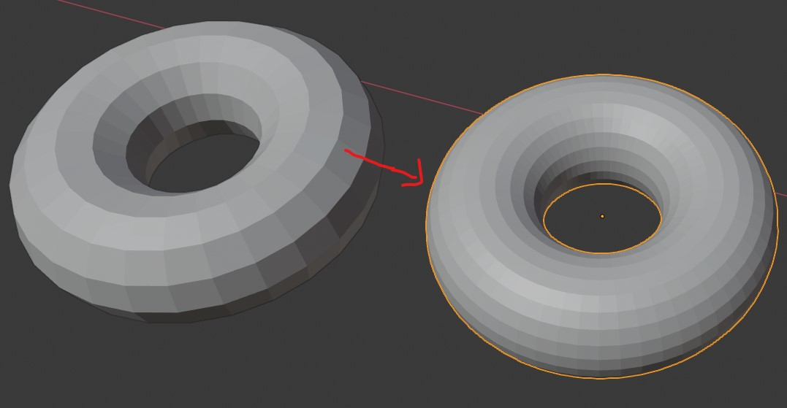
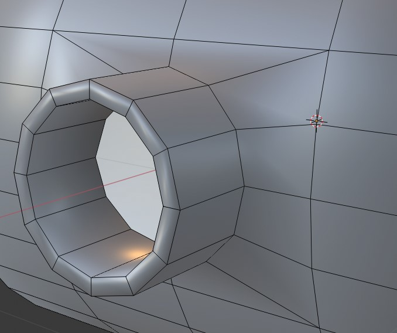
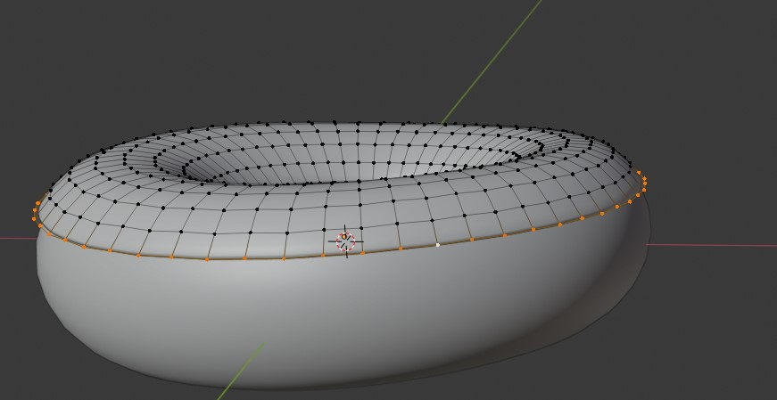
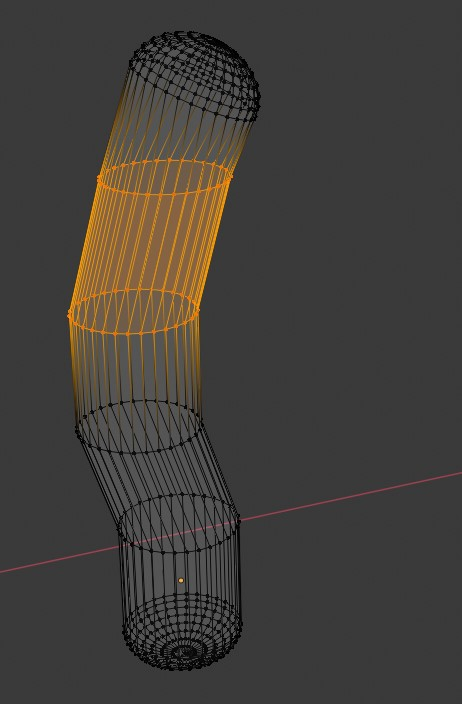
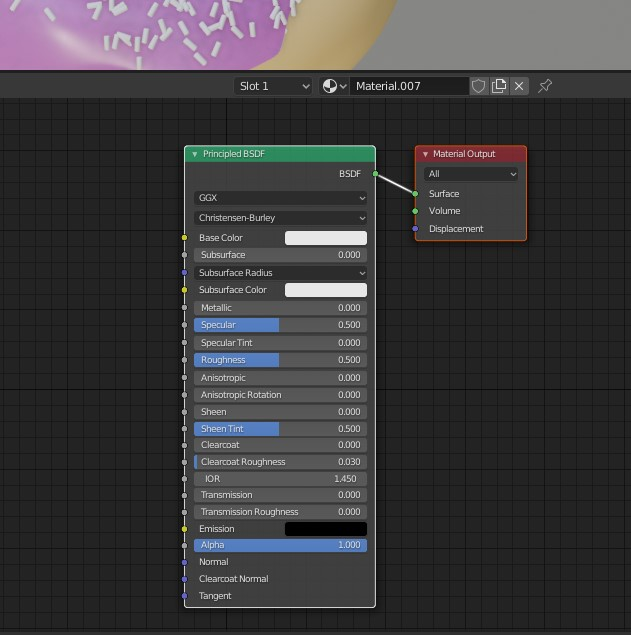
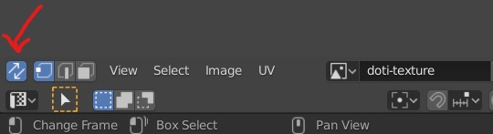
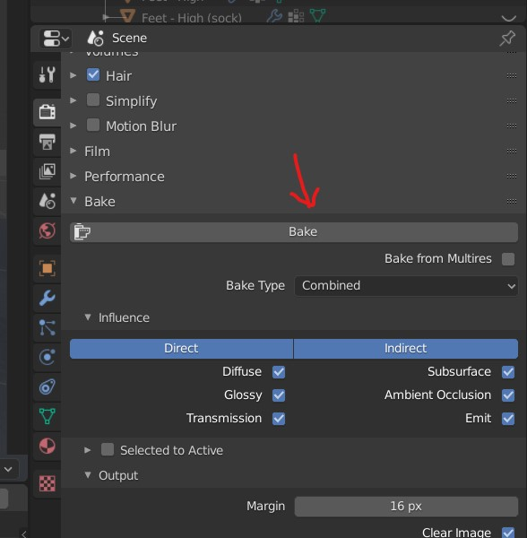

# Blender 2.82a
# Level 1

## Tranformation
- 
- <kbd>Left Click</kbd> on the object and tranform it
- <kbd>Right Click</kbd> to reset the tranform

### Menu
<kbd>SHIFT</kbd> + <kbd>Space</kbd>

### Select inverse degrees
- hit <kbd>SHIFT</kbd> + axis key

### Rotate
- <kbd>R</kbd>
- type the degrees
- or press <kbd>CTRL</kbd> while moving to have 5 degree change

## viewport

### Toggle visibility
- if while importing some mesh from old version are looking as if they are disabled
- 
- also enable the selection and viewport option in filter menu

### Menu
- Press <kbd>N</kbd>

### Change the  axis
- <kbd>`</kbd> to open the menu
- Numpad keys
- <kbd>ALT</kbd> + <kbd>Middle Mouse</kbd> + move mouse

### Split the viewport
- <kbd>Right Click</kbd> on the red marking
- 

### Rendered 
To see the light on the object
- 
- or Press <kbd>Z</kbd>

### Light
- 

### Light settings
- 

### 3D cursor
Drops the new objects over the 3d cursor when they are added in the viewport
- 
- <kbd>SHIFT</kbd> + <kbd>Right Click</kbd> - to move it
- <kbd>SHIFT</kbd> + <kbd>C</kbd> - to centre the cursor

- <kbd>SHIFT</kbd> + <kbd>S</kbd> to get menu
- Select `cursor to selected`

### Change View for the mode (Layout, sculpting, etc)
- Press <kbd>N</kbd>
- 

### Render Engine
- 
- can change the render engine to Eveee (For Low graphics ex. games)
- can change the render engine to Cycles (For High graphics)

### Create a image
- Render -> Render Image
- Or Press <kbd>F12</kbd>

### View through the camera
- 

### Face orientation
See which face is viewable
- 

### Start Search
- <kbd>F3</kbd>

### Toggle X Ray
- 

## Editing the object

### Add
- <kbd>SHIFT</kbd> + <kbd>A</kbd> to add mesh

### Smooth the object
- select the object by clicking on the object
- 

### delete face
- select the face
- press <kbd>X</kbd>
- 

### Select faces
- 
- then click on the middle of the faces

#### Flip Normals
- 
- Select all vertices
- <kbd>SHIFT</kbd> + <kbd>N</kbd>
- or search for normal recalculations

### Edges
- 
- To open up the Edge menu
- <kbd>CTRL</kbd> + <kbd>E</kbd>

#### Edge Filling
- select the edge and press <kbd>F</kbd> to add a face to part shown in image
- 

#### Expand edge
- <kbd>CTRL</kbd> + <kbd>B</kbd>

## Edit Mode
- make sure the shape keys basis is selected and the 'Apply Shape keys in edit mode' is off
- 

### Proportional editing
For editing the vertices near by
- 
- Enable it
- select any vertice or vertices
- Press <kbd>G</kbd> and move the object
- 
- Scroll mouse up or down to get the lumpiness

### Extrude face
- select vertices
- Press <kbd>E</kbd>

#### Pull the surrounding of face (Crease)
- select vertices
- Press <kbd>SHIFT</kbd> + <kbd>E</kbd>

### Creating a bridge between cut faces
- 
- Select cut faces
- press <kbd>F3</kbd> and search for Bridge

### Moving the vertices
To stick the dragging object on the surface, instead of going inside the surface of other selections
- 

### move vertex along the edge
- Select the vertex and double press <kbd>G</kbd>
- 

### Follow another object
- Atfore joining
- 
- Select the parent object
- Then select the child object
- <kbd>CTRL</kbd> + <kbd>P</kbd> and select the `Object (Keep Transform)`
- After Joining
- 

### Merge or join object
- <kbd>CTRL</kbd> + <kbd>J</kbd>

## Armature (Bones)
- 

### create groups of bones
- Go to edit mode
- 
- select top head of the bone
- press <kbd>E</kbd> and drag

### Add to a mesh
- select the mesh first and then the bones
- Press <kbd>CTRL</kbd> + <kbd>P</kbd>
- 
- 

### adding the bones we get the modifiers
- 
- 
- after adding bones to the mesh

<b>Note:</b> The order of modifiers is important

### Removing bones from mesh
- select the mesh and then the bones
- <kbd>ALT</kbd> + <kbd>P</kbd>

### select bones
- 

### Subdivision Surface
We can smooth the surfaces with these
- 

#### Bulid up
- 
- 
- 

### Solidyfy
- 

### Shrink wrap
- add the target object, select project mode if required
- 

## Selection
<b>Note:</b> Edit mode should be on

### enable brush selection
- Press <kbd>C</kbd> and 
- Scroll for scaling
- <kbd>Middle Mouse</kbd> to Undo
- <kbd>Right Click</kbd> to disable

### Select the duplicates on the object 
- <kbd>SHIFT</kbd> + <kbd>D</kbd> to duplicate the selection
- Select any vertice of the duplicate
- <kbd>CTRL</kbd> + <kbd>L</kbd>

### Seperate the selection
- <kbd>SHIFT</kbd> + <kbd>D</kbd> to duplicate the selection
- Press <kbd>P</kbd> and select the `Selection` option

### All
- <kbd>Left Click</kbd> on the object
- Press <kbd>A</kbd>

### loops
- <kbd>ALT</kbd> + <kbd>Left Click</kbd> the vertex for vertical or horizontal selection of the lines running through the vertex
- 
- <kbd>CTRL</kbd> + <kbd>I</kbd> to invert the selection

### Hide the selection
- Press <kbd>H</kbd>
- To unhide <kbd>ALT</kbd> + <kbd>H</kbd>

### Extrude the selection
- Select the vertices
- Press <kbd>E</kbd>

### Create a loop on the mesh
- 
- Select the model
- <kbd>CTRL</kbd> + <kbd>R</kbd>
- scroll up and down to add more loops or reduce

### Create loop inside a circle
- Select a circle
- Press <kbd>I</kbd> and Drag

## Subdivide
<b>Note:</b> Edit mode should be on
- <kbd>Right Click</kbd> on the object
- Select `Subdivide`

### Increase the smoothness
- 

## Adding Material
- 
- 

### Material Properties
- Color
- Roughness (glossy to rough)
- Subsurface
  - Radius - R, G, B
  - Color 
    - give similar to object color
    - this is when the light goes into the object
    - like the thin layer of skin becomes red as we see it on the bright light
- Transmission - make it 1 for glass
  - to remove the tint the base color should vue should be 1

### Copying material
- Select the object which you want to apply material to
- Select the object which you want to apply material from
- <kbd>CTRL</kbd> + <kbd>P</kbd> and select Materials

### water like depth and color
- 

### Adding another material
- select the parts or faces of the object
- 

## Weight Paint
- 
- reduce weight to have blue
- more weight gives red

### More weight paint layers on object
- 

### Select bones while painting
- Go to `object mode`
- Select the bones
- select the mesh
- Go to `weight paint mode`
- <kbd>SHIFT</kbd> + <kbd>Left Click</kbd> on bone to select
- <kbd>SHIFT</kbd> + <kbd>ALT</kbd> + <kbd>Left Click</kbd> on bone to unselect

### weird weight paint
- in the brush stroke - check if `Stabilize stroke` is ON

### Weight trasfer using data transfer modifier
- 

### Tranfer weight 
- select the bones
- select the mesh
- go to weight paint
- select the envelop
- 
- vertex will be added for that bone

## Adding Particles 
- Select the object on which you want to add particles
- 
- Option Emmission -> seed - emits a different pattern in the way partcles are added

### Select the object to duplicate on top of previously selected object
- 
- Select the object

### Rotate
- 

### selecting the vertex group (weight painter group)
- Particle property -> Vertex Group
- 

### set origin
The origin is the point which will be attached to the surface of the object on which the particles are added
- Select the objects
- <kbd>Right Click</kbd> 
- set origin -> origin to geometry

### set priority
- 

### New rest pose
- 
- select the mesh you want in new pose
- copy the armature modifier and apply
- select the armature and go to pose mode
- 

# Sculpting

## Brush
- To adjust the brush press <kbd>F</kbd>
- To adjust the brush strenth press <kbd>F</kbd> + <kbd>F</kbd>

# Shading
- Select new object
- Add material
- 

## Add new node
- <kbd>SHIFT</kbd> + <kbd>A</kbd>

## Common nodes
- input -> object info
- converter -> color ramp
- texture -> image texture

## Procedural Texturing
- Texture -> Noise texture
- <kbd>CTRL</kbd> + <kbd>SHIFT</kbd> + <kbd>Left Click</kbd> on the noise menu panel

<b>Note:</b> Also in the preferences enable add on - noise wrangler

- add vecter -> displacement
- 
- <kbd>CTRL</kbd> + <kbd>SHIFT</kbd> + <kbd>Left Click</kbd> on the panel `principled BSDF` (main layer)
- View in the render mode

### 2 layers of Procedural Texturing
- add 2 noise texture
- pass one through colorRamp - to darken the 2nd noise
- Add them
- Overlay the texture with noise and set the displacement scale very low
- 

# Texture Paint
- Add new texture
- save the new texture on the hard drive or <kbd>ALT</kbd> + <kbd>S</kbd> for quick save
- Go to shading and add `texture -> image texture`
- select the neew texture in the node

## Choose Color
- Press <kbd>N</kbd>
- pick the new color
- Press <kbd>X</kbd> to select

## Texture Mask
- Go to texture mask
- New
- 

### Brush Overlay (darken with same color)
- 

# UV Editing

## Enable UV editor
- 

## Perform UV editing
- select the lines on the object and <kbd>Right Click</kbd> and Mark Seam
- Press <kbd>U</kbd> for UV editing menu and select `Unwrap`
- also we can use the <kbd>CTRL</kbd> + <kbd>E</kbd> edge menu to mark seam

### brush select
- Press <kbd>C</kbd> 
  - <kbd>Right Click</kbd> to exit
  - Scroll up / down for brush size

## keep the UV without mesh selection
- 

## Create an image
This gives us the UV Map - only after the uv are baked and saved in image file we can edit the UV mesh  
- Once the unwrap is done
- go to camera tool
- 
- Bake it to write maps in the file

## Menu
- 

## Reset UV unwrap
- Select the object you want to reset the UV
- Press <kbd>U</kbd> for UV editing menu
- Reset

## Error while UV unwrap
### Object has non uniform scale 
We get the error because the scales are different  

- Select the Object
- Go to object mode
- <kbd>CTRL</kbd> + <kbd>A</kbd>
- Scale

### if UV Square doesnt work
If the addon doesn't work when you load it and select "to grid by shape", duplicate the mesh with Shift+D in object mode and try on the new mesh. It'll work. It's a bug.