# Particle system
## Add new particle
- add a mesh and select it
- 

## Viewing settings
### render mode divisions or segments
- 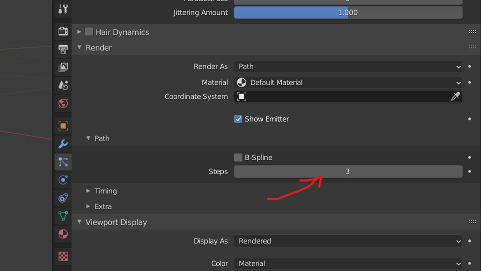

### viewing shading steps
- more steps meaning more sub surface division
- 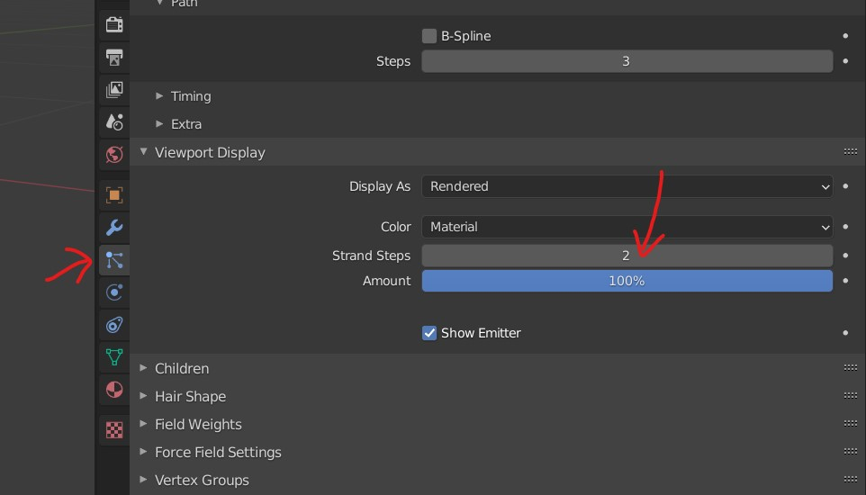

## Children particles
- 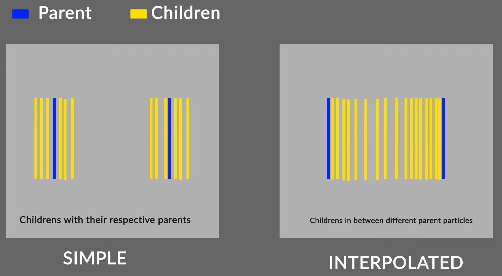

### Clumping
- settings under particle ->children -> clumping
- 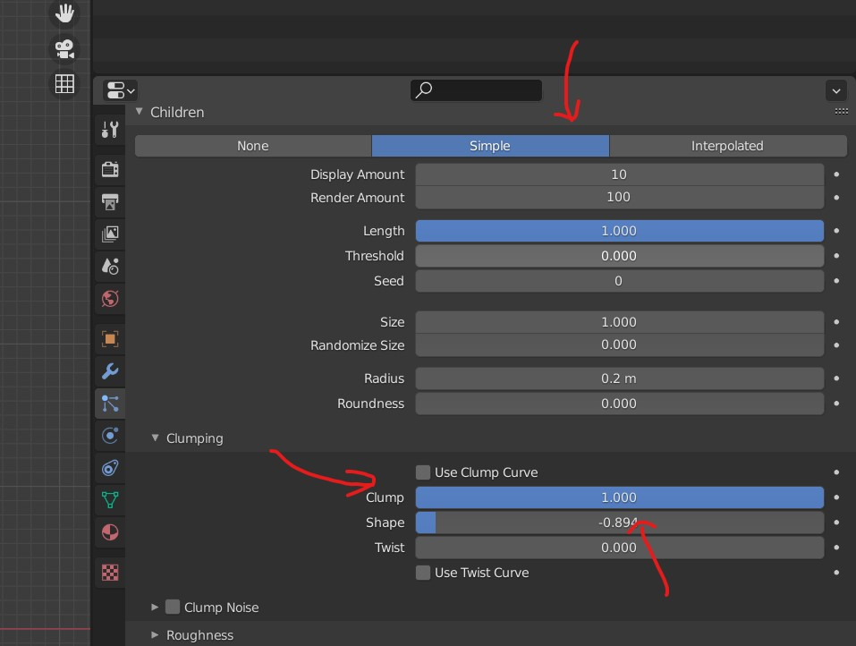
- 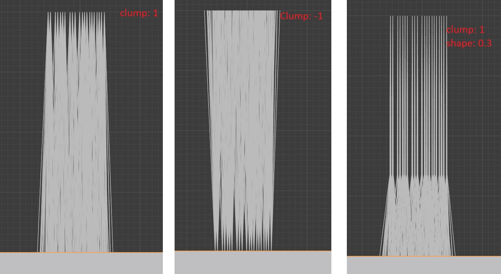

### Roughness
- adjust random and size
- threshold - to control how many strands will be affected by roughness setting
- 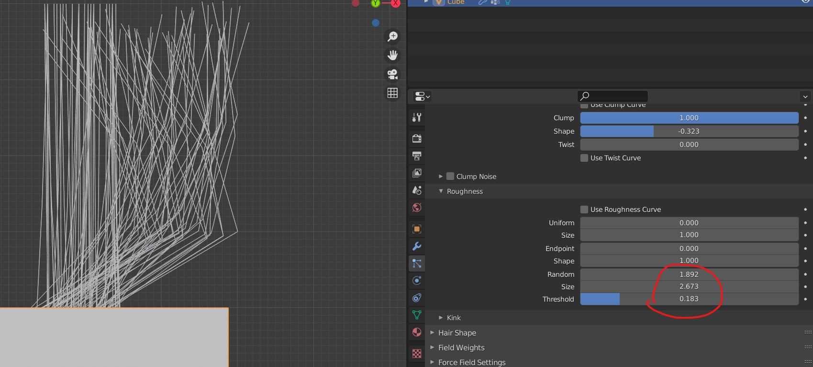

### kink 
- have a sine wave in your hair
- 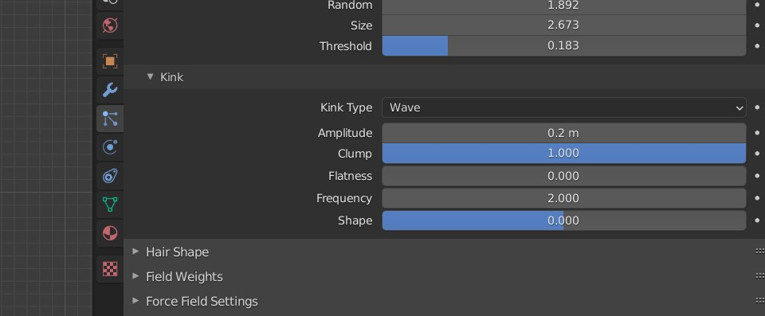

### Hair shape
- control size of each hair
- 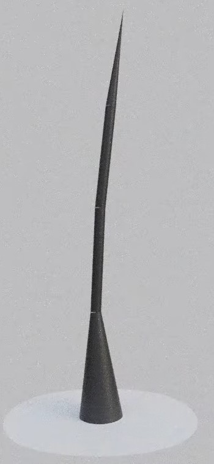
- 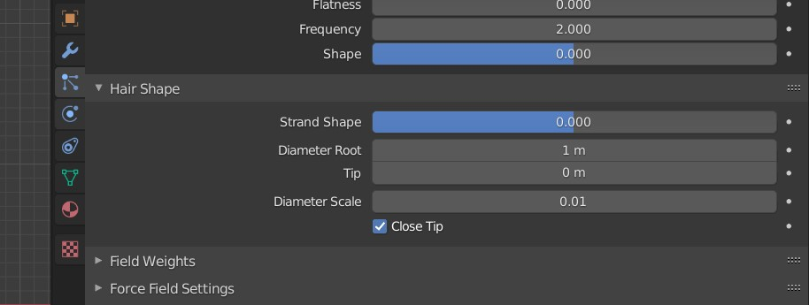

## Particle edit mode
- select the number of segments and number of hairs
- seed - random distribution and positioning of the strands

### Selection mode
- tip selection or mid point selection
- 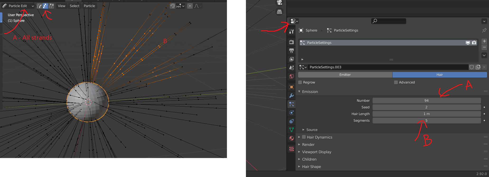

### Tools property
- preserve root
- extend the hair
- avoid clipping root
- 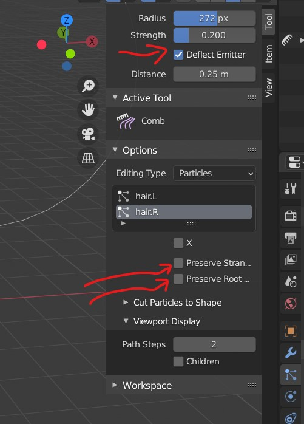