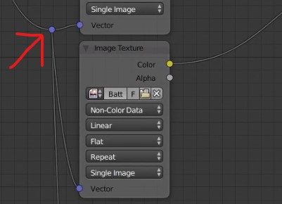
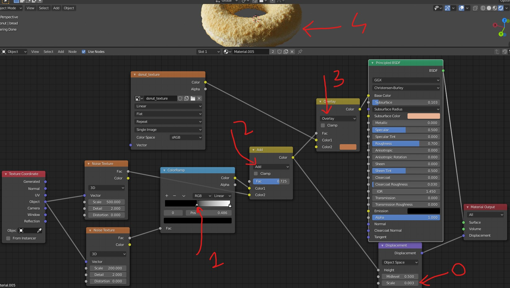

# Shading
- 

## minimize/expand node
- <kbd>CTRL</kbd> + <kbd>H</kbd>

## node wrangler 
node wrangler add on lets you see the rendering of the node
- in the preferences enable add on node wrangler 
- <kbd>CTRL</kbd> + <kbd>SHIFT</kbd> + <kbd>Left Click</kbd> on the node

### Shortcuts

#### Mapping
- select the image texture 
- <kbd>CTRL</kbd> + <kbd>T</kbd>

## add material
- Select new object
- Add material
- 

## Add new node
- <kbd>SHIFT</kbd> + <kbd>A</kbd>

## Common nodes
- input -> object info
- converter -> color ramp
- texture -> image texture

## Combine lines
- <kbd>SHIFT</kbd> and <kbd>Left click</kbd> and drag the mouse over the lines to combine
- 

## Procedural Texturing
- Texture -> Noise texture
- add vecter -> displacement
- 
- <kbd>CTRL</kbd> + <kbd>SHIFT</kbd> + <kbd>Left Click</kbd> on the panel `principled BSDF` (main layer)
- View in the render mode

### 2 layers of Procedural Texturing
- add 2 noise texture
- pass one through colorRamp - to darken the 2nd noise
- Add them
- Overlay the texture with noise and set the displacement scale very low
- 