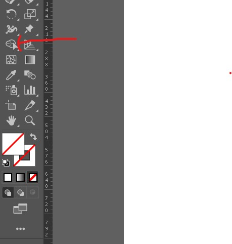

# Illustrator

## Image Trace
Object -> Image Trace -> Make and Expand

## Slice the objects
- to slice someting place another line object on it
- select the shape builder tool
- 
- drag the sliced parts

## export
- copy the selection and paste in photo shape as
  - smart object - object to be edited in Illustrtor
  - Shape Layer - edit in PS