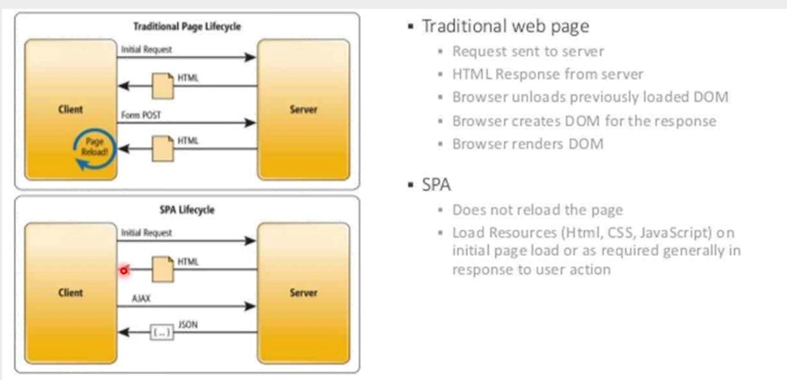
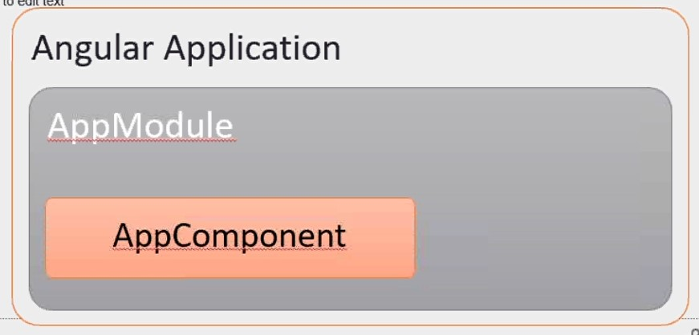
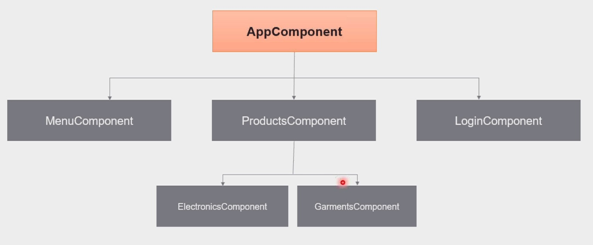
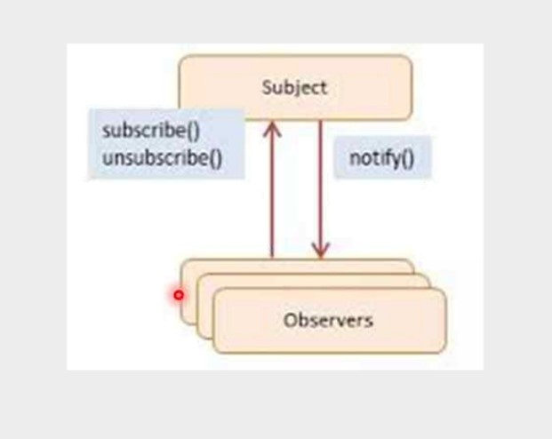
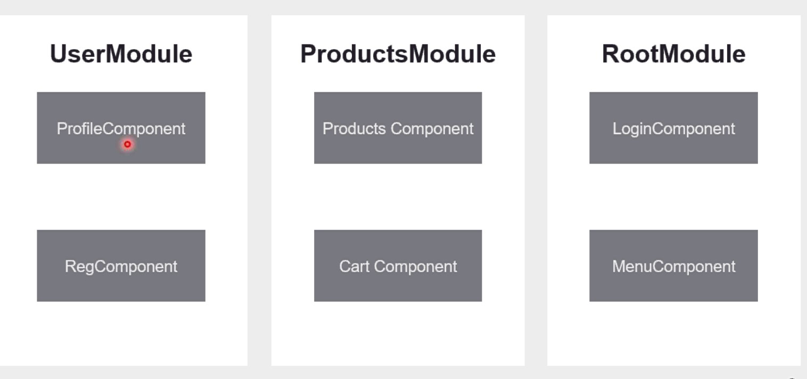
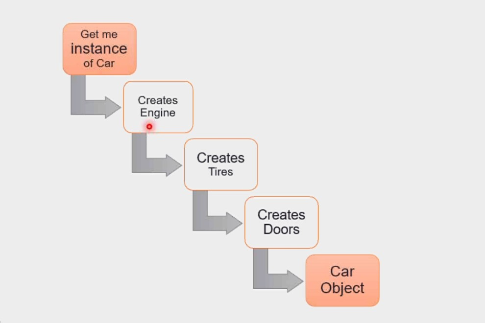
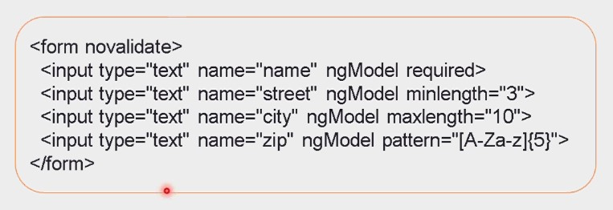

# What is Angular
- Framework to build SPA 
    - good for mobile app
    - less memory
- Targets all platform 
    - any OS
    - build and can be run any OS
    - could be used as normal HTML application
- Speed & performance
    - uses IV compiler

## Shell page
- The placedholder to put dynamic content inside

## Traditional vs SPA


## features
- Smaller builds
    - small bundled build size is smaller
- Typescript
    - super set of javascript
- Component Based
    - modulerize the application in smaller units
    - example - header, content, footer
- Annotations
    - @component
    - @module
- Reusability
    - directives, services, pipes 
    - to share data between the components
- Unit testable

## Concepts
- Modules
- Components
- Templates
- Directives
- Dependency Injection
- Routing
- Observables
- HTTP calls
- Services

## package
- packages in the form of modules
    - @angular/core
    - @angular/forms
    - @angular/http
    - @angular/router
- Hosted on NPM

## Ivy Compiler
- smaller bundle sizes
- faster testing
- better debugging
- improved css class and style binding
- improved type checking
- improved build errors
- improved build times, anabling AOT on by default

## cmds

### new
```
$ ng new <project-name>
```
- it installs `@angular/core, @angular/http, rxjs` etc

### serve 
```
$ ng serve
```
- Runs a dev server (Node.js) on localhost:4200 and host the app
- rusn the tranpiler in a watch mode

#### with different port
```
$ ng serve --host 0.0.0.0 --port 4201
```
## code Structure

### index.html
```html
/** where the angular code is put */
<app-root></app-root>
```

### angular overview


# Typescript
- helps finding errors at build time
- Typed language - String, number, boolean, enum
- we can write Object oriented programming
    - classes, interfaces, enums, access modifiers
    - strict null check
- Enhanced IDE support

## cons
- browsers do not support

## Transpilers
- convert the TS to equivalent JS

# Components
- are basic building blocks of angular application
- a component defines a patch of the screen
- example
    - navigation menu, login panel, shopping cart

## structure
- model
    - the data required 
    - for a login controller the model is 
        - userName, password
    - for a cartComponent
        - list of selected items
- view
    - HTML markup
- controller
    - controlling function acting on the data

## implementation
- with a typescript `class`
- annotated or decorated with `@Component`

```ts
@Component({
    selector: 'app-root',
    templateUrl: './app.component.html', // View
    styleUrls: ['./app.component.scss']
})
export class AppComponent { 
  title = 'my-dream-app';   // Model (data)
  // Controllers
  editTitle() {

  }
}
```

## Tree
- 
- AppComponent is root - which is placed in `bootstrap` property of its module

## generate
```
$ ng g c login
```

## component communication

### Parent to Child
- with @input() annotation
- mark the variable/object expected from parent
- child component
```ts
export class PriceUpdaterComponent {
    // data receiving by the component
    @Input()
    priceValue: number;
    constructor() {}
}
```
- parent component
```html
<td><app-price-updater [priceValue]="product.price"></app-price-updater></td>
```
<b>Note: </b> Not just primitive values, but also we can pass objects

### Child to Parent
```ts
// create an event to be emitted to the Parent component
@Output()
priceUpdaterEvent = new EventEmitter<Number>();

// emit the event with the value we need
updatePrice() {
    this.priceUpdaterEvent.emit(this.priceValue);
}
```
- parent
```html
/* Receive the data emitted in the child component in the
 * $event argument
 */
<td><app-price-updater (priceUpdaterEvent)="setNewPrice($event)"></app-price-updater></td>
```
### Child to Child
- if there is one time data exchange - common service will work
- for continous data exchange use `Observables`
    - handle multiple values over time

#### Observables
- The combination of a stream with a set of functional operators to transform streams leads us to the concept of `Observables`
- Functional Reactive Programming
    - as the observer and subject react and notify
- 
    - subject is data
    - observer subscribe to subject - `subscribe()`
    - whenever subject changes, observers are notified - `notify()`
    - after we can use `unsubscribe()`
- used when we are working with streams, such as
    - create streams, subscribe, read data, combine, transform

##### Example
```ts
// create new subject
subject = new Subject<string>();

// create an observer
this.subject.asObservable().subscribe(
    newValue => {
        this.userName = newValue;
    },
    err => {
        console.log(err);
    }
);

// subcribe callback will be called when we set the data in
// subject
this.subject.next(userName);
```

# Modules
- organize the application, also conponents, directive, services, pipes can be under modules
- has a suffix `.module`
- 
- root is geneneric
    - login
    - header, footer

## command
```
$ ng g m customers
```

## implementation
new modules created needs to be added to `imports`
```ts
@NgModule({
  declarations: [
    AppComponent,
  ],
  imports: [    // array of other modules used by this module
    BrowserModule,  // internally loads core module
    AppRoutingModule
  ],
  providers: [],
  bootstrap: [AppComponent]
})
export class AppModule { }
```

### bootstrap property
can be multiple components forming their tree of components

<b>Note:</b> Having multiple bootstrap component, creates multiple trees of components and while injecting dependencies (ex. services), we will have to inject it to multiple trees

# Binding

## Interpolation
```html
<p>{{title}}</p>
```
## property Bindings
``` html
/* square bracket */

```

## Event Binding
``` html
/* round bracket */
<button *ngIf="isLoggedIn" (click)="addToCart($event, product)">Add to Cart</button>
```

## Two way data binding
``` html
<input type="password" name="password" [(ngModel)]="password" />
```

<b>Note:</b> Requires Forms module

# directive

## core module
- *ngFor, *ngIf, * ngSwitch, ngStyle

# Services
for common data, utility, functions, objects

# Dependency Injection

## Need
- consider example of a car class
```ts
class Car {
    constructor() {
        this.engine = new Engine();
        this.tires = new Tires();
        this.doors = new TypeADoors();
    }
}
```

### Problems
- car class is creating instance of engine and tires
- difficult to unit test the classes
    - will have to test from the UI
- difficult to have different tires, engines to test he car class
- what if any contructor changes
- difficult to change the `TypeA`
- tightly coupled
- objects are not sharable

### Solution

- we say give me only car instance
    - which internally creates Engine, Tires and required type of doors

``` ts
let injector = ReflectiveInjector.resolveAndCreate([
    { provide: Car, useClass: Car },
    { provide: Engine, useClass: Engine },
    { provide: Tires, useClass: Tires },
    { provide: Doors, useClass: TypeBDoors },
]);
let carObj = injector.get(Car);
```

## Providers
- when a dependency is injected the compiler will look 
    - first in component level
        - then the module level

## Implementation

### Component level
```ts
@Component({
    ...
    providers: [{provide: ProductsDataService, useClass: ProductsDataService}]
})
// OR
@Component({
    ...
    providers: [ProductsDataService]
})
```

### Module level
- all components will get the same instance of the service
``` ts
@NgModule({
    ...
    providers: [ProductsDataService], 
    ...
})
```

# Pipes

## in built
- currency
```html
<td>{{product.price | curency: "INR"}}</td>
```

# HTTP Module
```ts
// app.module.ts
import { HttpClientModule } from "@angular/common/http";

@NgModule({
    imports: [
        ...
        HttpClientModule,
    ]
})

// services
import { HttpClient } from '@angular/common/http';

export class UserService {
  constructor(private http: HttpClient) { }
  getUsers(): Observable<any> {
    return this.http.get("https://jsonplaceholder.typicode.com/users");
  }
}
```

<b>Note: </b> Return the `Observable`

# Forms

## Template driven forms
- all validations code is in the `HTML` templates
- uses directives like ngModel to work with validators
- need to import module `FormsModules`
- 

### cons
- no flexibility to unit test, as everthing is in HTML
- less control in class
- handling is done with events

## Reactive Forms 
- also known as `Model driven approach`
- import ReactiveFormsModule from @angular/forms
- we create with FormControl instances

``` ts
import { FormsControl } from "@angular/forms"
export class SignUpFormComponent {
    name = new FormControl();
    phone = new FormControl();
}
```
    - set the initial values
    - set the validators

```ts
import { Validators } from "@angular/forms"
...
    name = new FormControl("Tina", Validators.required);
    phone = new FormControl("", Validators.minLength(8));
```

### form grouping
Helps in getting a consolidated (combined of all fields) status on entire form
    - i.e. whether the form is valid or NOT
```ts
this.signUpForm = new FormGroup({
    email: new FormControl(),
    password: new FormControl(),
    gender: new FormControl(),
    country: new FormControl(),
})
```

### field status
- $pristine - The field has not been modified yet
    - not touched and no value is modified
- $dirty - The field has been modified
    - if value is entered
    - fired on change event
- $valid - The filed content is valid
    - passes all `Validators`
- $invalid - The field content is not valid
    - fails the `Validators`
- $touched - The field has been touched
    - selecting the field
    - fired when user moves to another field
- $untouched - The field has not been touched
    - not selected the field

### show error based on condition
- template
```html
/* To convert this */
<div *ngIf="signUpForm.controls.email.invalid && signUpForm.controls.email.touched">Email is required</div>

/* to this */
<div *ngIf="email.invalid && email.touched">Email is required</div>
```
- component
```ts
get email() {
    return this.signUpForm.get("email");
}
```

#### Read error object
- required
- minlength
- maxlength
- email
- min
- max

```html
<div *ngIf="email.errors.required">Email is required</div>
<div *ngIf="email.errors.invalid">Email is invalid</div>
```

<b>Note: </b> use `ng-messages` instead of above approach

### Reactive feature
check on change
```ts
this.signUpForm.get("country").valueChanges
    .subscribe(
        keyword => {
        // HTTP call to fetch with keywords
        }
    )
```

# Routing
- menu component
```html
<li role="presentation"><a routerLink="login" >Login</a></li>  
<li role="presentation"><a routerLink="products" >Products</a></li> 
```
- app-router.module.ts
```ts
// app router module
const routes: Routes = [
  {
    path: "login",
    component: LoginComponent,
  },
  {
    path: "products",
    component: ProductListComponent,
  }
];

@NgModule({
  imports: [RouterModule.forRoot(routes)], // for root / paths
  exports: [RouterModule]
})
export class AppRoutingModule { }
```
- app.component.html
```html
<router-outlet>
```

## default
in app-router.module.ts
```ts
// 1.
const routes: Routes = [
  {
    path: "", // specify blank to make it default
    component: LoginComponent,
  },
]
// 2.
const routes: Routes = [
  {
    path: "", // specify blank to make it default
    redirectTo: "/login",
    pathMatch: "full", // regex expression can be used
  },
]
```

## handling invalid routes
```ts
const routes: Routes = [
  ...
  // this wild card for handling the invalid routes 
  // should be placed at the end of all routes
  {
    path: "**", // two stars
    component: pageNotFoundComponent,
  },
]
```

## Programatic routing
```ts
// import the service
import { Router } from '@angular/router';

export class LoginComponent implements OnInit {
    constructor(private loginService: LoginService, private router: Router) {}

    login(event: Event) {
        ...
        this.router.navigateByUrl("/products");
    }
}
```

## pass parameter to the child route
- menu compone
```html
<li *ngFor="let user of userList"><a [routerLink]="['userDetails', user.id]">{{user.name}}</a></li>

/** pass multiple parameters */
<li *ngFor="let user of userList"><a [routerLink]="['userDetails', user.id, user.name]">{{user.name}}</a></li>

/** finally use a router outlet to load the child component */
<router-outlet></router-outlet>
```

- child component
```ts
import { ActivatedRoute } from '@angular/router';

export class userDetailsComponent implements OnInit {
  constructor(private activeroute:ActivatedRoute) {
    // read the route parameters --- Observables
    this.activeroute.params.subscribe(
      routeParams => {
        this.userid = parseInt(routeParams['id']);
      })
  }
}
```

## Route guard
- To be self learned

# Deploy
```
$ ng build
```
- creates `dist` folder and optimized built

## integrating the Node server
in the node we can use res.send `index.html` from the dist folder

# test
runs all the spec files
```
$ ng test
```