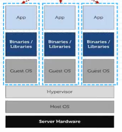
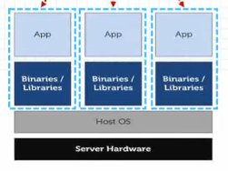
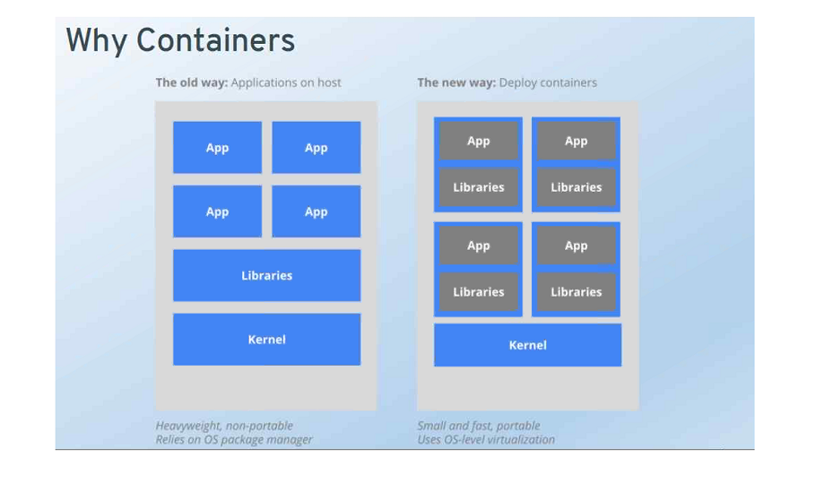
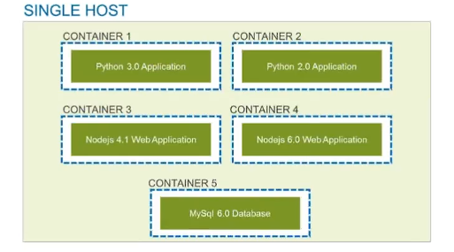
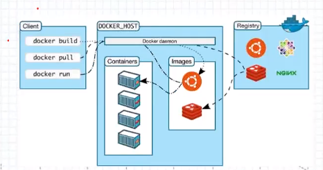
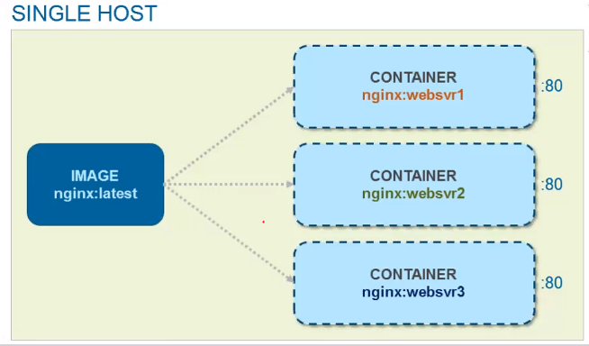
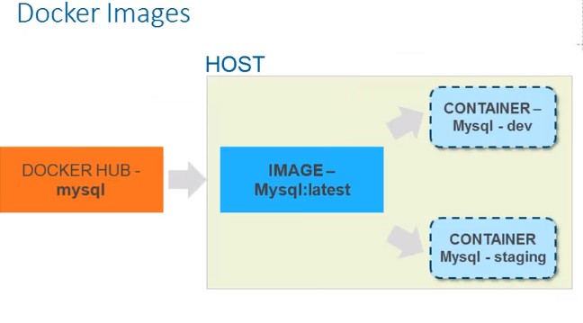

# Pledge to Docker
Docker helps to create a container which looks like VMs but it is different

    Mobi is the name of the aqua Whale in docker icon

- just similar to real world application - we pack all the goods in a shipping `big container` and send it across (via railway, airways etc)
- in programming we have local, stage, prod enviorments and our code should work in all.

### VMs vs Docker Containers
VMs | Containers
---- | ----
long | short - delete after test
more resources | less resources
 | 
long time to boot up | just in time
fewer instances can be created on a server | many on server

## Container
Defination - Containers are an `application-centric` way to deliver high performing, scalable applications on the infrastructure of your choice

    self contained enviornment build using one or more images (created from docker image)

- should be 1 process per container
- on windows we create windows containers
- on linux we create linux containers
- create images from the container
- concept `Volume` is used to pertain the data when the containers are deleted

### Why Container


- Works accross all env
- provides a clarity of env 
    - ex OS, technology stacks
- one docker server can have multiple containers which can have different OS, settings etc
- Reasons why we need docker
    - host a website
    - start mongo db with different version
    - host an ansible (devices with 0 delay) server
    - test my application
    - Host LDAP server
- orchestrating (automating the resource mangement)
    - 

### Contains
- made up of 1 image or `no` image
    - lightweight OS
- libraries
- application code

### Provides Isolation
- we create a VM to create a isolated env like old version of software
- but they are heavyweight - relies on OS package manager
- for VMs we have to select OS
- but container are lightweight - uses `OS level virtualization`

## Installation and config
    inside windows and mac docker creates linux VM called `MOBY`

- Windows
    - we need `hypervisor (Hyper V) software` to create windows VMs

## Architecture


### client
- ask the host to build or create the containers
- specify which container need how much resources (RAM, HDD, CPU), default is shared
- dynamically specify whether caching (redis) is to be enabled or after the container is created then enable it

### Host
- computer running docker engine
- windows OS cannot be a host - docker creates a linux VM (known as MOBY) and that is the HOST
- linux can be directly a HOST
- has the docker deamon (application to run, pull container)
    - used to build run and distribute containers
- creates the container with images
- use redis for caching

#### In depth


- here image has `nginx` which is a `repo` and `latest` is a version, images occupy hadrdisks space
- containers are running version of `images` so they occupy the RAM, here `websvr1` is its name
- 80 is the port, ie container has own IP and port

### Registry
- server for docker daemon to fetch repositories and images
- official is docker hub

### images
- they are not `templates` as of VMs
- read only layer of the file system that never changes (blue print of the running container)
- we can modify the image and create or recreate the container(s)
- we cannot delete it if there is a container running on it



1 container for `dev` and other for `staging`

### Docker file
a file containing docker commands to configure and build images from existing images and other ingredients

### Repositories
set of images on local docker or register server

## Docker Hub
its like git hub

    https://hub.docker.com

official repo provied by the docker to store container images created by official community members

```
// to get the IP of docker vm
docker-machine ip default

docker pull mysql:8
docker pull mysql:latest

docker images // provide list of images locally
docker image pull <name> // fetch from hub
docker image rm <image Id> // rm from local
docker image inspect <image id> // view details of image
```

## Working with a container
- download the image
```
docker image pull ubuntu
```

- run - start a new container based on the image name
- -it - start interactive terminal to configure the container
- --name - name of the container to select it ex. ubuntu-os
- ubuntu - image name used for pull
- /bin/bash - command to run inside the container
```
docker container run -it --name ubuntu-os ubuntu /bin/bash
```

<b>Note:</b> do not specify the image name before the run 

```
// display the container in all the states
docker container ls -a

// old commands for listing
docker container ps -a

// pause the execution
docker container pause <part of container id text>
docker container unpause <part of container id text>

// status becomes stoped
docker stop <part of container id text>
docker start <part of container id text>

// go to the container terminal
docker container attach <part of container id text>

// delete the container
docker rm -f <part of container id text>

// delete multiple container in one go
docker rm <container id 1> <container id 2> <container id ...>

// show live resource usage by the container
docker stats <container id>

// shows details about container created
docker inspect <container id>

// gives the process ids 
docker top <container id>
```

<b>Note:</b> we cannot rm a paused container, we need to forcefully with `-f`

- 8085 - provide port at which the server must run
- 80 - is a container port
- -d - detach the terminal i.e. do not go into the terminal like an `OS`
```
docker container run -d -p 8085:80 --name webserver nginx
```

- `-P` for random port
- `-p` and specify the port as `8085:80`
```
docker container run -d -P --name <container-name> <image-name>
```

## Custom Images


while creating images from container the docker will use the same images from which the container was created and will manage them efficiently


### Dockerfile
helps in creating a custom image
```dockerfile
FROM node:6
EXPOSE 3000
COPY server.js .
CMD node server.js
```

<b>Note:</b> compose will help in creating multiple images

```
// to tag the image
docker image build -t <docker account userName>/<image name> .

// create the container
docker container run -d -p 3000:3000 --name <container name> <docker account userName>/<image name>

// push to docker hub
docker push <docker account userName>/<image name>
```