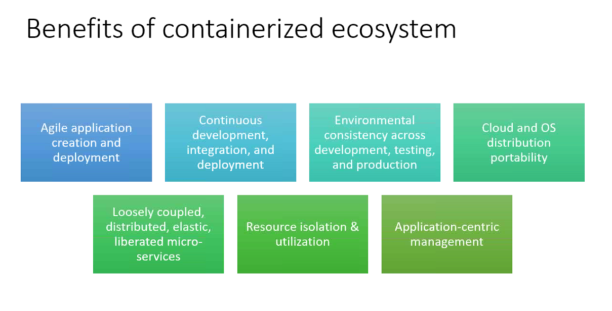
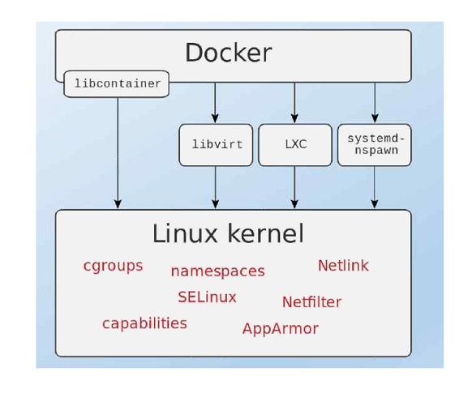

# Pledge to Docker
Docker helps to create a container which looks like VMs but it is different

    Moby is the name of the aqua Whale in docker icon

- just similar to real world application - we pack all the goods in a shipping `big container` and send it across (via railway, airways etc)
- in programming we have local, stage, prod enviorments and our code should work in all.

### VMs vs Docker Containers
VMs | Containers
---- | ----
long | short - delete after test
more resources | less resources
 | 
long time to boot up | just in time
fewer instances can be created on a server | many on server

### Why we want VM or Docker
- we create a VM to create a isolated env like old version of software
- but they are heavyweight - relies on OS package manager
- for VMs we have to select OS, while container share the OS kernel
- but container are lightweight - uses `OS level virtualization`

## Docker (anologous to the hypervisor which helps creating containers)
- open source
- automates deployment of the software using containers
- guarantees it will always run the same regardless of the env (from `dev` to `ops`)
- configure just once
    - eliminates inconsistencies between env
    - improves the speed of CI/CD jobs

### Why
- portable
- isolation
- automation (build, deploy, integration)
- Dependency management

### Usage
- Sandbox env
- CI/CD
- scaling apps
- PaaS, SaaS

## Container (run time instance)
Defination - Containers are an `application-centric` way to deliver high performing, scalable applications on the infrastructure of your choice

    self contained enviornment build using one or more images (created from docker image)

- should be 1 process per container
- on windows we create windows containers
- on linux we create linux containers
- create images from the container
- the container uses `linux kernel` sercurely (without exploiting it)
- concept `Volume` is used to pertain the data when the containers are deleted

### Why Container




- Works accross all env
- provides a clarity of env 
    - ex OS, technology stacks
- one docker server can have multiple containers which can have different OS, settings etc
- Reasons why we need docker
    - host a website
    - start mongo db with different version
    - host an ansible (devices with 0 delay) server
    - test my application
    - Host LDAP server
- provides flexibility with speed and security, which a VM is not good at
- orchestrating (automating the resource mangement)
    - 

### Contains
- made up of 1 image or `no` image
    - lightweight OS
- libraries
- application code

### Types
#### OS Containers (Like VM)
 - has its OS such as ubuntu, we install other apps like node js, mongo and our code, and then we run the application
 - no layered file systems by default
 - built on cgroups, namespaces
 - an example can be a ubuntu container, with our code and other modules installed in it

#### App Containers
- get a OS container and install just 1 application (1 process) and then have multiple such containers running parellely
- Layered File system 

## Installation and config
    inside windows and mac docker creates linux VM called `MOBY`

- Windows
    - we need `hypervisor (Hyper V) software` to create windows VMs

```
// to check the docker installation
docker run hello-world
```

## Architecture


### client
- user uses this client which has RESTful API or sockets to interact with daemon
- ask the host to build or create the containers
- specify which container need how much resources (RAM, HDD, CPU), default is shared
- dynamically specify whether caching (redis) is to be enabled or after the container is created then enable it

### Host
- computer running docker engine
- windows OS cannot be a host - docker creates a linux VM (known as MOBY) and that is the HOST
- linux can be directly a HOST
- has the docker daemon (application to run, pull container)
    - used to build run and distribute containers
    - manages the containers
- creates the container with images
- use redis for caching

#### In depth


- here image has `nginx` which is a `repo` and `latest` is a version, images occupy hadrdisks space
- containers are running version of `images` so they occupy the RAM, here `websvr1` is its name
- 80 is the port, ie container has own IP and port

### Registry
- server for docker daemon to fetch repositories and images
- official is docker hub
- public, private repositories

### images
- they are like classes while containers are objects
- they are not `templates` as of VMs
- read only layer of the file system that never changes (blue print of the running container)
- images are based on another images
- we can modify the image and create or recreate the container(s)
- we cannot delete it if there is a container running on it


1 container for `dev` and other for `staging`

### Docker file
a file containing docker commands to configure and build images from existing images and other ingredients

### Repositories
set of images on local docker or register server

## Docker Hub
its like git hub

    https://hub.docker.com

official repo provied by the docker to store container images created by official community members

```
// to get the IP of docker vm
docker-machine ip default

docker pull mysql:8
docker pull mysql:latest

docker images // provide list of images locally
docker image pull <name> // fetch from hub
docker image rm <image Id> // rm from local
docker image inspect <image id> // view details of image
```



### Docker base stack
- Namespaces
    - pid namespace - process isolation
    - net namespace - network interfaces
    - ipc namespace - inter-process communication
    - mnt namespace - mount points
    - uts namespace - unix time sharing
- control groups
    - resource isolation (allocate cpu, memory)
    - multi tenency (all containers in isolation)
    - setting limits and container (give a visauliztion like a VM)

## Working with a container
- search images in CLI
```
docker search <image name: tag>
```
- download the image
```
docker image pull ubuntu

// list images
// here the image id is unique accross the docker hub
// same image ids will be seen on every local machine
docker images
```

- inspect the image
    - show layers
        - layers depends on the action performed on the images
        - layers are shared accross the images as they are read only and so that they can provide unique file systems to the images
        ```
        "RootFS": {
            "Type": "layers",
            "Layers": [
                "sha256:f2cb0ecef392f2a630fa1205b874ab2e2aedf96de04d0b8838e4e728e28142da",
                "sha256:fe08d5d042ab93bee05f9cda17f1c57066e146b0704be2ff755d14c25e6aa5e8",
                "sha256:318be7aea8fc62d5910cca0d49311fa8d95502c90e2a91b7a4d78032a670b644"
            ]
        },
        ```

Save the images (if we dont have access to docker hub i.e `registry`), the traditional way
```
docker save <image id> -o <name>.tar

// load its layers back
docker load -i <name>.tar
```

<b>Note:</b> we can also use `import` command

Now after loading it back, it wont have repo name and tag, since they are `user defined` at the `registry level` ie. the `docker hub` </br>
however we can add them back with
```
docker tag <image id> <name>:<tag>
```

pushing the images onto the registry i.e docker hub
```
docker tag <current image name>:<tag> <docker hub url or our user name>/<the name we want for the image>

// example
docker tag nginx:1.17 badgamerbad/nginx:1.18
```
<b>Note:</b> if we create a image from another image than if we go into docker VM where it saves the image layers, we will find only one layer, `docker efficiency`.

History
```
$ docker history <image id>
IMAGE               CREATED             CREATED BY                                      SIZE                COMMENT
470671670cac        6 weeks ago         /bin/sh -c #(nop)  CMD ["/bin/bash"]            0B
<missing>           6 weeks ago         /bin/sh -c #(nop)  LABEL org.label-schema.sc…   0B
<missing>           7 weeks ago         /bin/sh -c #(nop) ADD file:aa54047c80ba30064…   237MB
```
shows the layers and metadata
    - metadata - 0B example a enviorment added to it
    - layers are big in size

```
// Create a container
docker create <image name>:<tag>

// display the container in all the states
docker container ls -a

// OR
docker ps -a

// start a container
docker start <part of container id text>
```
<b>Note:</b> the container will exit immediately since there is `no process` given to the container, i.e we need a daemon process running inside the container

```
// encapsulates both docker create and start
docker run <image id>:<tag>

// pause the execution
docker container pause <part of container id text>
docker container unpause <part of container id text>

// status becomes stoped
docker stop <part of container id text>

// go to the container terminal
docker container attach <part of container id text>
// OR
docker exec -it <part of container id text> bash

// delete the container
docker rm -f <part of container id text>

// delete multiple container in one go
docker rm <container id 1> <container id 2> <container id ...>

// show live resource usage by the container
docker stats <container id>

// shows details about container created
docker inspect <container id>

// gives the process ids 
docker top <container id>
```

<b>Note:</b> we cannot rm a paused container, we need to forcefully with `-f`

Starting a container directly from images

- 8085 - provide port at which the server must run
- 80 - is a container port
- -d - detach the terminal i.e. do not go into the terminal like an `OS`
```
docker container run -d -p 8085:80 --name webserver nginx
```

- `-P` for random port
- `-p` and specify the port as `8085:80`
```
docker container run -d -P --name <container-name> <image-name>
```

- run - start a new container based on the image name
- -it - start interactive terminal to configure the container
- --name - name of the container to select it ex. ubuntu-os
- ubuntu - image name used for pull
- /bin/bash - command to run inside the container
```
docker container run -it --name ubuntu-os ubuntu /bin/bash
```

Saving the state of container as image and creating a snapshot of a `stopped` container
```
docker commit -m "message" <container id> <give a image name><give a tag number>
```

<b>Note:</b> do not specify the image name before the run 

Starting a container with set ENV
```
docker run -it -h my-centos -e JAVA_HOME=/opt/java -w /opt --name my-centos centos bash
```
<b>Note:</b> on windows /opt wont be present


## Custom Images


while creating images from container the docker will use the same images from which the container was created and will manage them efficiently


### Dockerfile
helps in creating a custom image
```dockerfile
FROM node:6
EXPOSE 3000
COPY server.js .
CMD node server.js
```

<b>Note:</b> compose will help in creating multiple images

```
// to tag the image
docker image build -t <docker account userName>/<image name> .
```
<b>Note:</b> This way we wont have to use `commit` to create layers manually, `Dockerfile` will automatically create it 

```
Step 2/6 : WORKDIR /code
 ---> Using cache
 ---> efd2bb4b569d
Step 3/6 : ENV FLASK_APP app.py
 ---> Using cache
 ---> 6111a4412a22
```
<b>Note:</b> The Command is smart so that if we add more instructions, it runs only new instructions

```
// create the container
docker container run -d -p 3000:3000 --name <container name> <docker account userName>/<image name>

// push to docker hub
docker push <docker account userName>/<image name>
```

#### Legends
Key | Value
-|-
From | from what type or which image you to create new image
Run | install softwares or run OS commands (combination of instructions)
CMD | run commands to start some script </br> ex. `node server.js`
ADD/COPY | Copy files or directories from host to conatianer in given path
EXPOSE | exposes the specified port to the host machine </br> kind of `METADATA`
ENTRYPOINT | specify the script/program to run when container starts </br> which gives a process to the container and keeps the container running </br> So container will exit when these are over <br> Usaully OS Container does not have an Entrypoint, because they provide building blocks for other applications </br> nginx has entry point, centos doesnt

## Network
- Port Mapping - to expose container to HOST
- Bridge - between containers
```
$ docker network ls
```

After inspecting the container we get its ip, which can be used by other container to access this contianer

ex. if `172.17.0.3` is ip of `container-1`, then we can login into `contianer-2` and use this ip `172.17.0.3` to connect to `container-1`

To expose the container ports to host
```
// publish
docker run -d -p <localhost port>:<container port> <image-name>
```
Ex. - to start nginx and access it on localhost:8085 of the `HOST` machine
```
docker run -d -p 8085:80 nginx
```