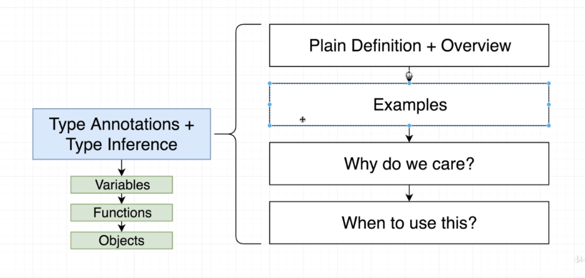

# Section 3: Type Annotations in Action

## Type Annotations
We tell the typescript what type we want on variables, functions, objects

## Type Inference
Let typescript decide what type we want on variables, functions, objects